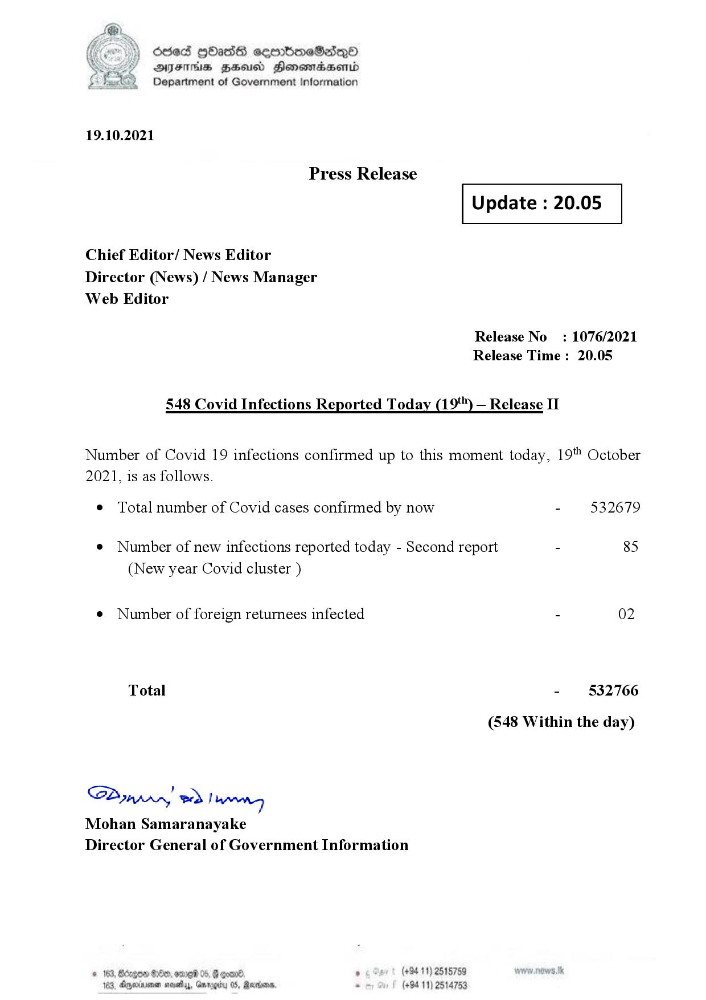

# Press Release - 2021.10.19 - Covid 19 Infection Report 
Key: 1796243d78343a629e13416359232479 

---
```
dosed GOass eemmbmeSadepO
DFS BHU Honswnradasentd
Department of Government Information

 

 

19.10.2021

Press Release

Chief Editor/ News Editor
Director (News) / News Manager
Web Editor

 

 

Update : 20.05

 

 

Release No

: 1076/2021

Release Time : 20.05

548 Covid Infections Reported Today (19) — Release II

Number of Covid 19 infections confirmed up to this moment today, 19" October

2021, is as follows.

¢ Total number of Covid cases confirmed by now

¢ Number of new infections reported today - Second report

(New year Covid cluster )

¢ Number of foreign returnees infected

Total

SP nprrn wd Ianwng
Mohan Samaranayake
Director General of Government Information

 

. (+94 11) 2515759
(+94 11) 2514753

532679

85

02

532766

(548 Within the day)

```
