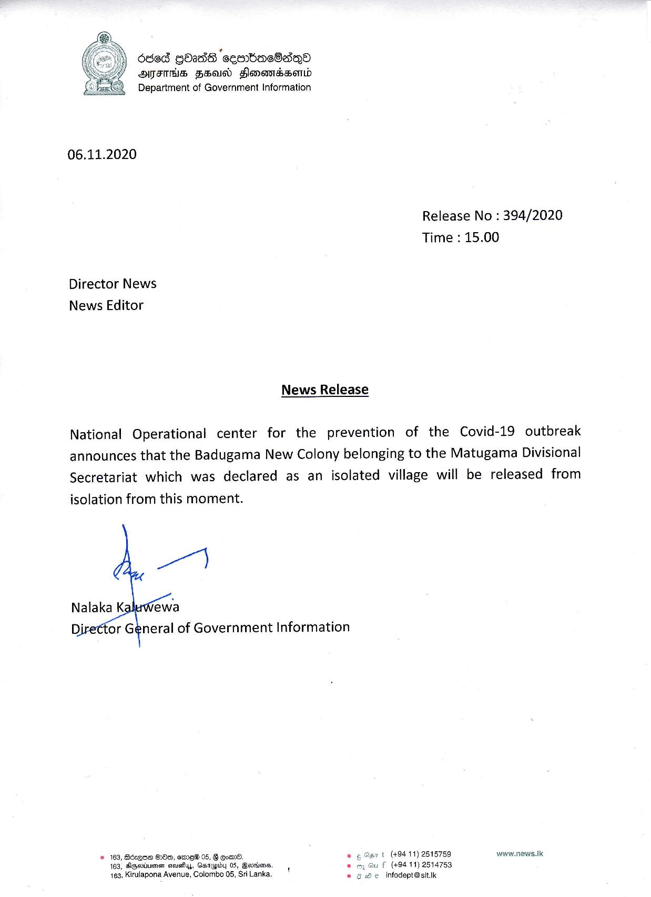

# Press Release - 2020.11.06 - Badugama New Colony will be released from isolation 
Key: 17b61718af6c0adfcc6533ac89846d1c 

---
```
6868 0138 ‘ceo tac8dqQo
OTITIS FIN) Slonewisserld
Department of Government Information

 

06.11.2020

Release No : 394/2020
Time : 15.00

Director News
News Editor

News Release

National Operational center for the prevention of the Covid-19 outbreak
announces that the Badugama New Colony belonging to the Matugama Divisional
Secretariat which was declared as an isolated village will be released from
isolation from this moment.

Nalaka Kaluwewa
tor General of Government Information

   

 
 

2 163, Bézqee 8:80, ere 05, 8 gor. . yt (+94 11) 2515759 www.news.Ik
163, Sepsis steuaFiyy, CsTUpby 05, Barrknm. 1 f (49411) 2514753
163, Kirulapona Avenue, Colombo 05, Sri Lanka. © He. infodept@sitik

 

```
