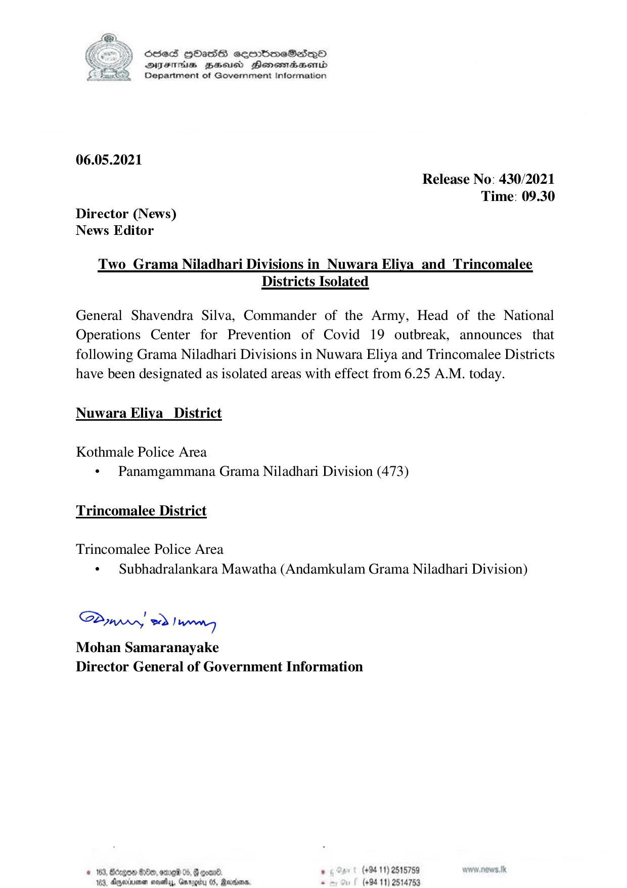

# Press Release - 2021.05.06 - Two Grama Niladhari Divisions in Nuwara Eliya and Trincomalee Districts Isolated 
Key: 17c3ca34f36383bf49c1fabbd8b30be7 

---
```
S865 HOasS eqrmbmeSs—oO
DFTs BHousd Henombaend
Department of Government Information

 

06.05.2021

Release No: 430/2021
Time: 09.30
Director (News)
News Editor

Two Grama Niladhari Divisions in Nuwara Eliya _and_ Trincomalee
Districts Isolated

General Shavendra Silva, Commander of the Army, Head of the National
Operations Center for Prevention of Covid 19 outbreak, announces that
following Grama Niladhari Divisions in Nuwara Eliya and Trincomalee Districts
have been designated as isolated areas with effect from 6.25 A.M. today.

Nuwara Eliya District

Kothmale Police Area
« Panamgammana Grama Niladhari Division (473)

Trincomalee District
Trincomalee Police Area

¢ Subhadralankara Mawatha (Andamkulam Grama Niladhari Division)

Saw) 2) wn
Mohan Samaranayake
Director General of Government Information

© 163, Bcagon $00, ome 05, @ coan®. , (+94 11) 2518759
103, Anetra aevethy, Garygty 0S, Rerddens. . (+94 11) 2514753

```
