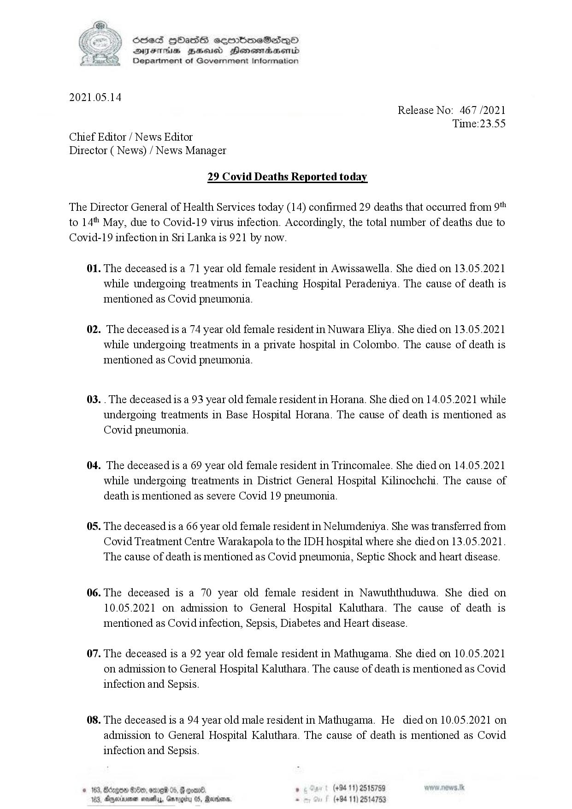

# Press Release - 2021.05.14 - Covid 19 infection deaths 
Key: 18344fca040a5a027eb36f99d7f43aa3 

---
```
 

 

Sed Hbass seembmeSese—p©O
DIF BHusd Henemadaenrd
Department of Government Information

2021.05.14

Release No: 467 /2021
Time:23.55

Chief Editor / News Editor
Director ( News) / News Manager

29 Covid Deaths Reported today

The Director General of Health Services today (14) confirmed 29 deaths that occurred from 9t*
to 14% May, due to Covid-19 virus infection. Accordingly, the total number of deaths due to

Covid-

01.

02.

03.

04.

05.

06.

07.

08.

 

19 infection in Sri Lanka is 921 by now.

The deceased is a 71 year old female resident in Awissawella. She died on 13.05.2021
while undergoing treatments in Teaching Hospital Peradeniya. The cause of death is
mentioned as Covid pneumonia.

The deceased is a 74 year old female resident in Nuwara Eliya. She died on 13.05.2021
while undergoing treatments in a private hospital in Colombo. The cause of death is
mentioned as Covid pneumonia.

. The deceased is a 93 year old female resident in Horana. She died on 14.05.2021 while
undergoing treatments in Base Hospital Horana. The cause of death is mentioned as
Covid pneumonia.

The deceased is a 69 year old female resident in Trincomalee. She died on 14.05.2021
while undergoing treatments in District General Hospital Kilinochchi. The cause of
death is mentioned as severe Covid 19 pneumonia.

The deceased is a 66 year old female resident in Nelumdeniya. She was transferred from
Covid Treatment Centre Warakapola to the IDH hospital where she died on 13.05.2021.
The cause of death is mentioned as Covid pneumonia, Septic Shock and heart disease.

The deceased is a 70 year old female resident in Nawuththuduwa. She died on
10.05.2021 on admission to General Hospital Kaluthara. The cause of death is
mentioned as Covid infection, Sepsis, Diabetes and Heart disease.

The deceased is a 92 year old female resident in Mathugama. She died on 10.05.2021
on admission to General Hospital Kaluthara. The cause of death is mentioned as Covid
infection and Sepsis.

The deceased is a 94 year old male resident in Mathugama. He died on 10.05.2021 on
admission to General Hospital Kaluthara. The cause of death is mentioned as Covid
infection and Sepsis.

. (+94 11) 2515789 w.nows Jk
(+94 11) 2514753

```
