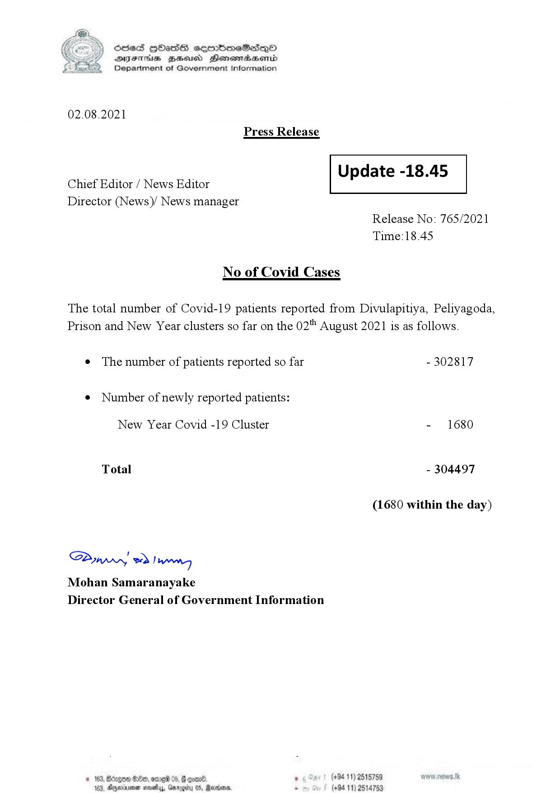

# Press Release - 2021.08.02 
Key: 199a8cd0f34a84ad37c8ca7ba38038e0 

---
```
S) ScseS HOasdS cerrbmeSdQo
DFTs BHEosd Henewtaeasernid
Department of Government Information

 

02.08.2021
Press Release

Chief Editor / News Editor
Director (News)/ News manager

 

 

Update -18.45

 

 

Release No: 765/2021
Time:18.45

No of Covid Cases

The total number of Covid-19 patients reported from Divulapitiya, Peliyagoda,

Prison and New Year clusters so far on the 02" August 2021 is as follows.

e The number of patients reported so far
¢ Number of newly reported patients:

New Year Covid -19 Cluster

Total

Sawwy 2) wry
Mohan Samaranayake
Director General of Government Information

 

- 302817

- 1680

- 304497

(1680 within the day)

(+94 11) 2515789
(+94 11) 2514753

```
