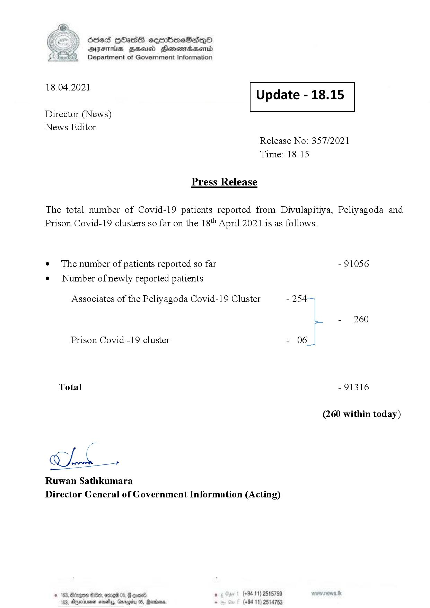

# Press Release - 2021.04.18 
Key: 19b8320b51ad2cf841a918e3a9af269a 

---
```
\) O63 GOadS ceortimeSzdQO
AIFS BHU Henewmadasentd
Department of Government Information

 

 

18.04.2021 Update - 18.15

 

 

 

Director (News)

News Editor
Release No: 357/2021
Time: 18.15

Press Release

The total number of Covid-19 patients reported from Divulapitiya, Peliyagoda and
Prison Covid-19 clusters so far on the 18" April 2021 is as follows.

e The number of patients reported so far - 91056

¢ Number of newly reported patients

Associates of the Peliyagoda Covid-19 Cluster - 254
- 260
Prison Covid -19 cluster - 06
Total - 91316
(260 within today)

Chak

Ruwan Sathkumara

 

Director General of Government Information (Acting)

© 163, degen 0, ore 05, @ goand ° (+94 11) 2515759
163, Aparna nasty, Garogiry 0S, Rerrioare, . (+94 11) 2514753

```
