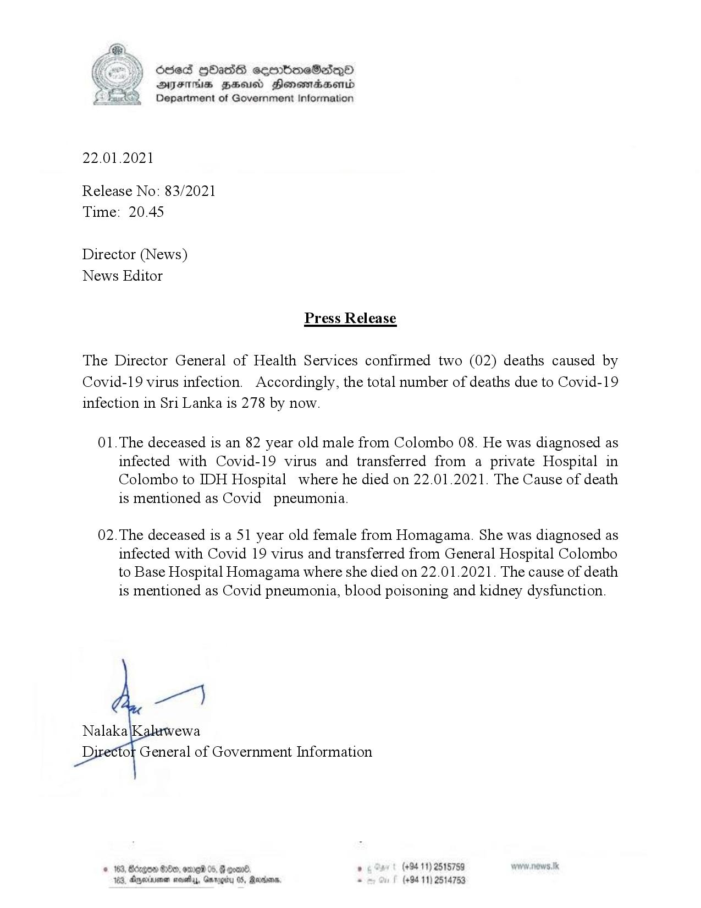

# Press Release - 2021.01.22 -02 Covid 19 infection deaths have been reported, total deaths rises to 278 
Key: 19cb3ab091ad8df7195cda73a59c5c07 

---
```
) Sed HOasS ceenbneSdQo
AIFS BHU Honemtradaertd
Department of Government Information

 

22.01.2021

Release No: 83/2021
Time: 20.45

Director (News)
News Editor

Press Release

The Director General of Health Services confirmed two (02) deaths caused by
Covid-19 virus infection. Accordingly, the total number of deaths due to Covid-19
infection in Sri Lanka is 278 by now.

01.The deceased is an 82 year old male from Colombo 08. He was diagnosed as
infected with Covid-19 virus and transferred from a private Hospital in
Colombo to IDH Hospital where he died on 22.01.2021. The Cause of death
is mentioned as Covid pneumonia.

02.The deceased is a 51 year old female from Homagama. She was diagnosed as
infected with Covid 19 virus and transferred from General Hospital Colombo
to Base Hospital Homagama where she died on 22.01.2021. The cause of death
is mentioned as Covid pneumonia, blood poisoning and kidney dysfunction.

ger)

Nalaka ewa
Director General of Government Information

, (+9411) 2515759
(+94 11) 2514753

 

```
