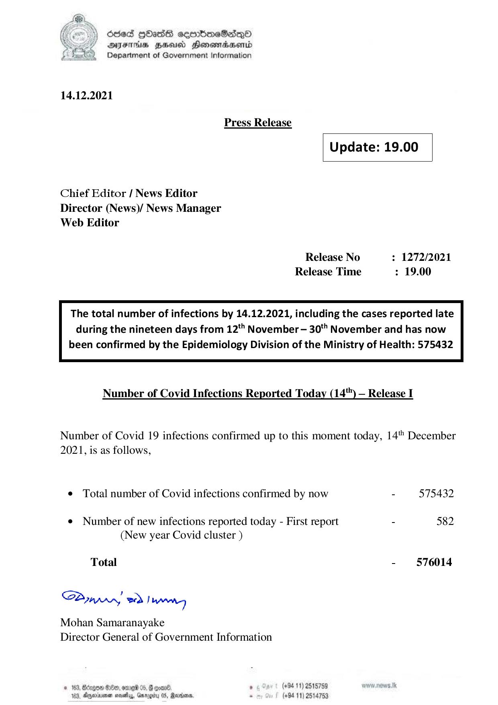

# Press Release - 2021.12.14 
Key: 1a90079950c35ea7b62fa81bc91d459c 

---
```
dosed GOHasS eoeorimeSadqd
DFTs HEU Honewmdbaertd
Department of Government Information

 

14.12.2021

Press Release

Update: 19.00

 

Chief Editor / News Editor
Director (News)/ News Manager
Web Editor

Release No : 1272/2021
Release Time : 19.00

The total number of infections by 14.12.2021, including the cases reported late
during the nineteen days from 12** November — 30" November and has now

been confirmed by the Epidemiology Division of the Ministry of Health: 575432

 

Number of Covid Infections Reported Today (14'") — Release I

Number of Covid 19 infections confirmed up to this moment today, 14" December
2021, is as follows,

¢ Total number of Covid infections confirmed by now - 575432

e¢ Number of new infections reported today - First report - 582
(New year Covid cluster )

Total - 576014
SPynprn, wd Jaane

Mohan Samaranayake
Director General of Government Information

$0, ome 05, 4 goa ’ (+94 11) 2518759

3, Agmininen nota, Gmrogiy 05, Baron - (+94 11) 2514753

 

 

```
