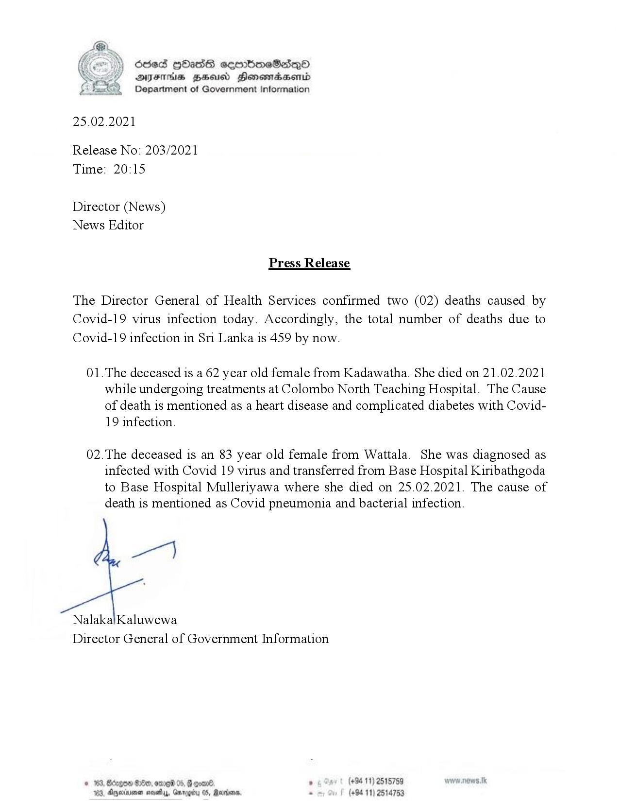

# Press Release - 2021.02.25 - Covid 19 Infection deaths 
Key: 1b1147fe44bb6c90685628a8e04223dc 

---
```
(ce) Sed QHOadsS ceorboeSadqQo
YY DAYFIHs HHS Honewiadasend
Department of Government Information

 

25.02.2021

Release No: 203/2021
Time: 20:15

Director (News)
News Editor

Press Release

The Director General of Health Services confirmed two (02) deaths caused by
Covid-19 virus infection today. Accordingly, the total number of deaths due to
Covid-19 infection in Sri Lanka is 459 by now.

01.The deceased is a 62 year old female from Kadawatha. She died on 21.02.2021
while undergoing treatments at Colombo North Teaching Hospital. The Cause
of death is mentioned as a heart disease and complicated diabetes with Covid-
19 infection.

02.The deceased is an 83 year old female from Wattala. She was diagnosed as
infected with Covid 19 virus and transferred from Base Hospital Kiribathgoda
to Base Hospital Mulleriyawa where she died on 25.02.2021. The cause of
death is mentioned as Covid pneumonia and bacterial infection.

pe)

NalakalKaluwewa
Director General of Government Information

© 163, Borgen G00, omreid 05,  ooar® * (+94 11) 2515759
103, Agerienen seve, Gnrggiiy OS, Martone 2 (+94 11) 2514753

```
