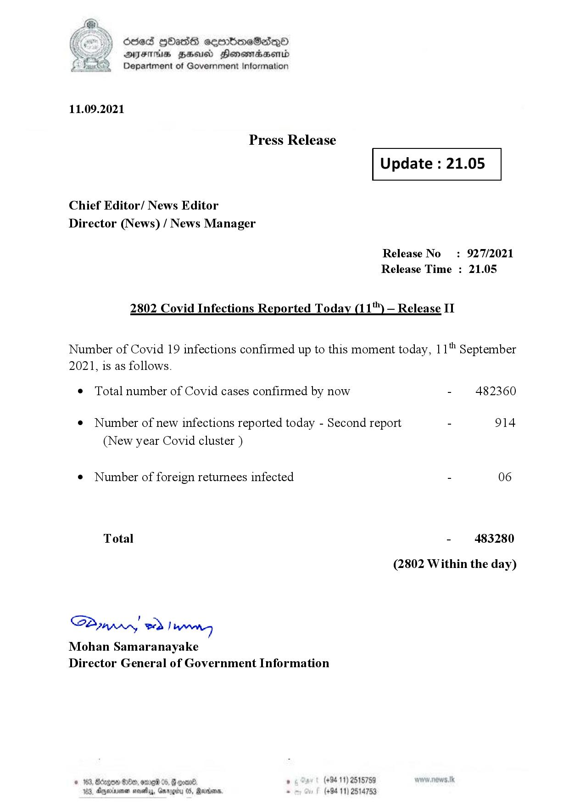

# Press Release - 2021.09.11 - Covid 19 Infection Report 
Key: 1b1cb7f5bc20223b5b0c5d6a996ecf3e 

---
```
dosed GOass eemmbmeSadepO
DFS BHU Honswnradasentd
Department of Government Information

 

 

11.09.2021

Press Release

Chief Editor/ News Editor
Director (News) / News Manager

2802 Covid Infections Reported Today (11) — Release II

Number of Covid 19 infections confirmed up to this moment today, 1

2021, is as follows.

¢ Total number of Covid cases confirmed by now

 

 

Update : 21.05

 

 

Release No

: 927/2021

Release Time : 21.05

¢ Number of new infections reported today - Second report -

(New year Covid cluster )

¢ Number of foreign returnees infected

Total

SPynprn wd Inn
Mohan Samaranayake
Director General of Government Information

  

© 163, Bdogon Om, ome®

6. . (+94 11) 2515759
163, Dyeinionen sevethys, Gar S, Revco, . (+94 11) 2514753

jth

September

482360

914

06

483280

(2802 Within the day)

```
