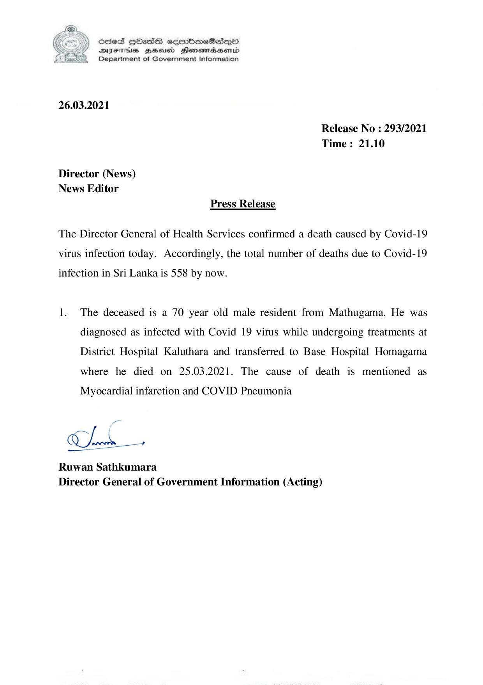

# Press Release - 2021.03.26 - Covid 19 infection deaths 
Key: 1c03287bae24943be62690b43cca17ec 

---
```
NY Scdes HhasS coorbmeSedqQoO
DFTs BHEosd Henewtaeasernid
Department of Government Information

 

26.03.2021

Release No : 293/2021
Time: 21.10

Director (News)
News Editor
Press Release

The Director General of Health Services confirmed a death caused by Covid-19
virus infection today. Accordingly, the total number of deaths due to Covid-19

infection in Sri Lanka is 558 by now.

1. The deceased is a 70 year old male resident from Mathugama. He was
diagnosed as infected with Covid 19 virus while undergoing treatments at
District Hospital Kaluthara and transferred to Base Hospital Homagama
where he died on 25.03.2021. The cause of death is mentioned as

Myocardial infarction and COVID Pneumonia

gx

Ch

Ruwan Sathkumara
Director General of Government Information (Acting)

```
