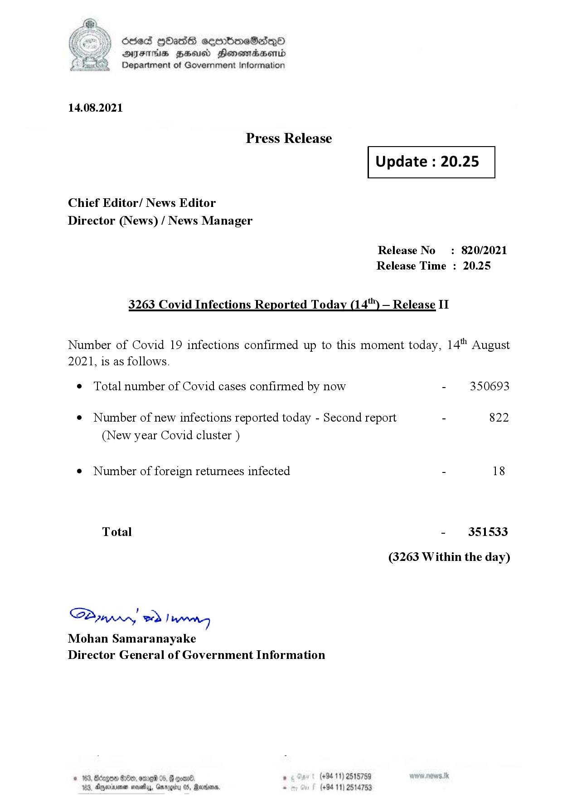

# Press Release  - 2021.08.14 
Key: 1ca09a880f990baac8bfab52ac9e782e 

---
```
dosed GOass eemmbmeSadepO
DFS BHU Honswnradasentd
Department of Government Information

 

 

14.08.2021

Press Release

Chief Editor/ News Editor
Director (News) / News Manager

3263 Covid Infections Reported Today (14'") — Release II

 

 

Update : 20.25

 

 

Release No

: 820/2021

Release Time : 20.25

Number of Covid 19 infections confirmed up to this moment today, 14" August

2021, is as follows.

¢ Total number of Covid cases confirmed by now

¢ Number of new infections reported today - Second report -

(New year Covid cluster )

¢ Number of foreign returnees infected

Total

SPynprn wd Ing
Mohan Samaranayake
Director General of Government Information

© 163, Bicegeen Be, ome 05, @
103, Dnerisemen saves, aro

 

. (+94 11) 2515759
(+94 11) 2514753

350693

822

18

351533

(3263 Within the day)

```
