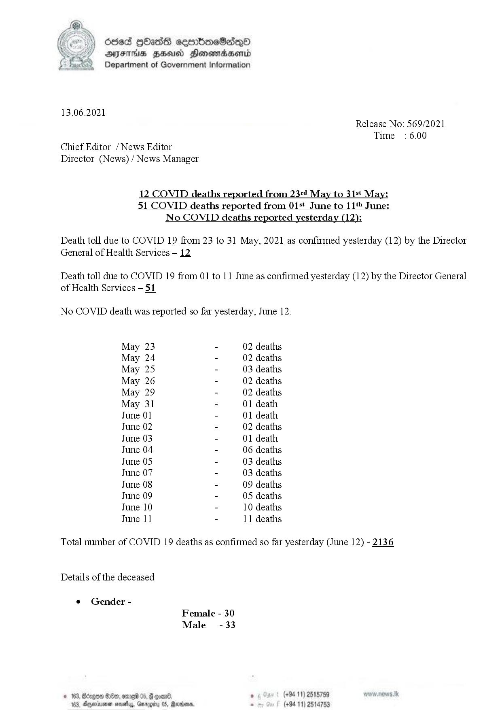

# Press Release - 2021.06.13 - Covid 19 infection deaths report ( yesterday) 
Key: 1ceadae2b5a862da4abe154f21b789a3 

---
```
ded [Oss cerrbcoeSadqQo
AIFS HHUO HonoswadHend
Department of Government Information

 

13.06.2021
Release No: 569/2021
Time : 6.00
Chief Editor / News Editor
Director (News) / News Manager

12 COVID deaths reported from 23"t May to 31st May:
51 COVID deaths reported from 01st June to 11 June:

No COVID deaths reported yesterday (12):

Death toll due to COVID 19 from 23 to 31 May, 2021 as confirmed yesterday (12) by the Director
General of Health Services - 12.

Death toll due to COVID 19 from 01 to 11 June as confirmed yesterday (12) by the Director General
of Health Services — 51

No COVID death was reported so far yesterday, June 12.

May 23 - 02 deaths
May 24 - 02 deaths
May 25 - 03 deaths
May 26 - 02 deaths
May 29 - 02 deaths
May 31 - 01 death
June 01 - 01 death
June 02 - 02 deaths
June 03 - 01 death
June 04 - 06 deaths
June 05 - 03 deaths
June 07 - 03 deaths
June 08 - 09 deaths
June 09 - 05 deaths
June 10 - 10 deaths
June 11 - 11 deaths

Total number of COVID 19 deaths as confirmed so far yesterday (June 12) - 2136

 

Details of the deceased
¢ Gender -
Female - 30
Male -33
© 163, SOx, onreh 05. H oom . (+94 11) 2515759
103, Ageia meets, Garey 0S, Maxims . (+94 11) 2514753

 

```
