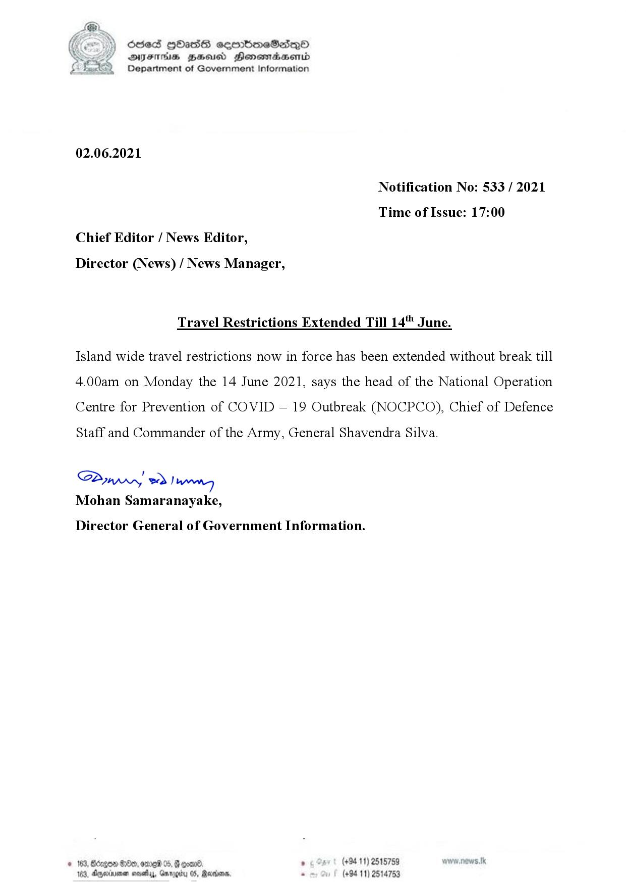

# Press Release - 2021.06.02 - Travel Restrictions Extented Till 14th June 
Key: 1d2e5cf889eb2fb2f110a54d87370c0a 

---
```
O53 HOHASS comdmeSadQoO
DFTs HH Henemadasentd
Department of Government Information

 

02.06.2021

Notification No: 533 / 2021
Time of Issue: 17:00

Chief Editor / News Editor,

Director (News) / News Manager,

Travel Restrictions Extended Till 14" June.

Island wide travel restrictions now in force has been extended without break till
4.00am on Monday the 14 June 2021, says the head of the National Operation
Centre for Prevention of COVID — 19 Outbreak (NOCPCO), Chief of Defence

Staff and Commander of the Army, General Shavendra Silva.

Sawwy 2) wry

Mohan Samaranayake,

Director General of Government Information.

. (+94 11) 2515759 Nv .NOWS. Tk
(+9411) 2514753

 

```
