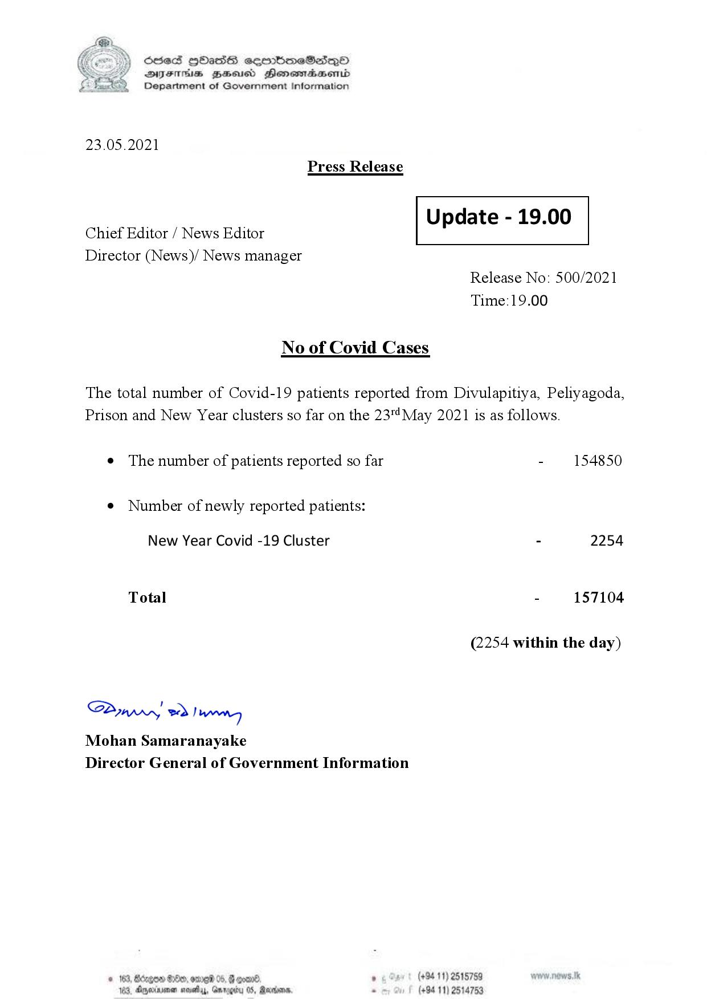

# Press Release - 2021.05.23 
Key: 1d384a7bdfaa1bfd9fcbfbbee9784724 

---
```
S) ScseS HOasdS cerrbmeSdQo
SVsThis geod Henssnadasombd
Department of Government Information

 

23.05.2021

Press Release

 

Update - 19.00

 

 

Chief Editor / News Editor
Director (News)/ News manager

 

Release No: 500/2021
Time:19.00

No of Covid Cases

The total number of Covid-19 patients reported from Divulapitiya, Peliyagoda,
Prison and New Year clusters so far on the 23™May 2021 is as follows.

¢ The number of patients reported so far - 154850

¢ Number of newly reported patients:

New Year Covid -19 Cluster - 2254
Total - 157104
(2254 within the day)

Saw 2) wong
Mohan Samaranayake
Director General of Government Information

  

gon 88x9, ere 06, @ evan ’ (+94 11) 2515759
Ageivme nosey, Garocy 0S, Redme . (+94 11) 2514753

```
