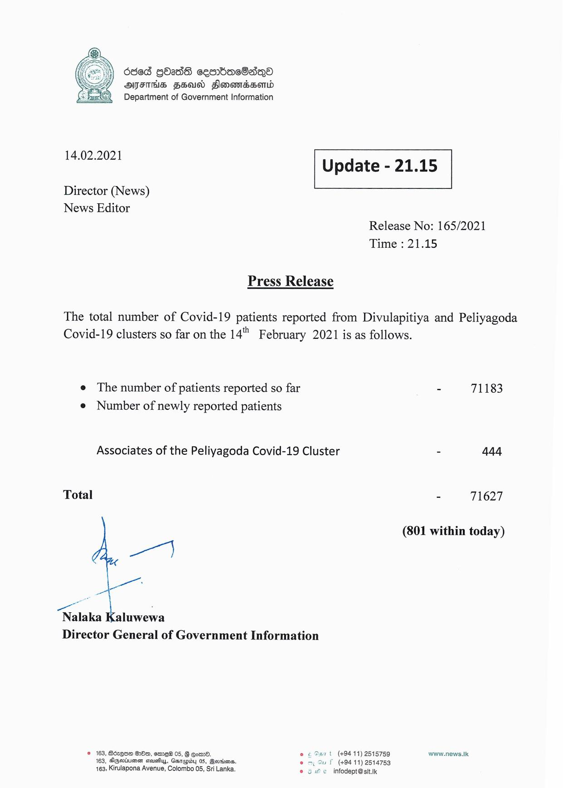

# Press Release - 2021.02.14 
Key: 1dd3b4538c9b1cabcee66baf975aea7e 

---
```
ded QOadS cesrbacSaqQo
AFIS FS Flonomassomtd
Department of Government Information

 

 

14.02.2021

 

Update - 21.15

 

 

Director (News)
News Editor

Release No: 165/2021
Time : 21.15

Press Release

The total number of Covid-19 patients reported from Divulapitiya and Peliyagoda
Covid-19 clusters so far on the 14". February 2021 is as follows.

e The number of patients reported so far
e Number of newly reported patients

Associates of the Peliyagoda Covid-19 Cluster

Total

ae"

ee
Nalaka Kaluwewa
Director General of Government Information

© 163, Bérene Oe, emre® 05, G Gotsr8.
163, Deeetumsn causiyy, Garapioy 05, evriens.
163, Kirulapona Avenue, Colombo 05, Sri Lanka.

t (+9411) 2515759
f (+94 11) 2514753
© infodept@sit.ik

  

- 71183

- 444

71627

(801 within today)

www.news.lk

```
