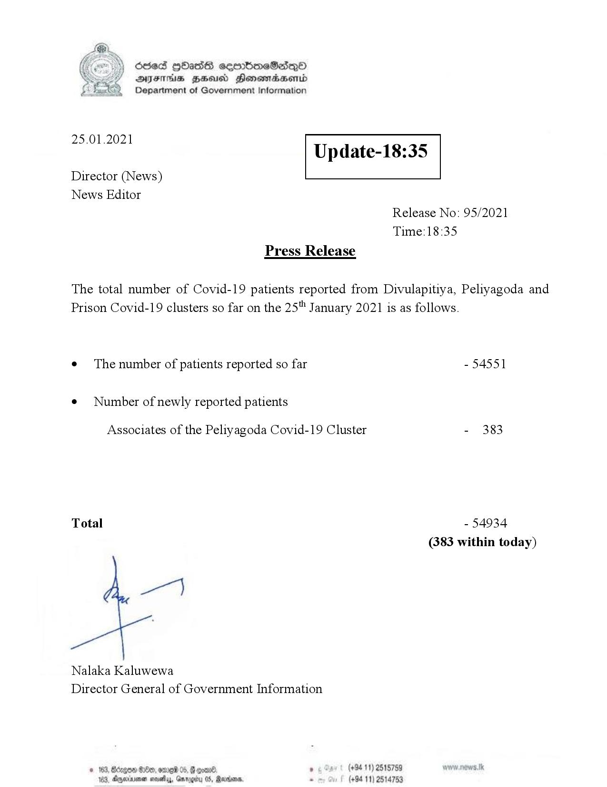

# Press Release - 2021.01.25 
Key: 1de2ef91b039cadb665258ab847cb4ec 

---
```
Ssed HbasG sembmeSadqo
DAIS BHU Honomasentd
Department of Government Information

 

 

25.01.2021

Update-18:35

 

 

 

Director (News)
News Editor
Release No: 95/2021
Time:18:35
Press Release

The total number of Covid-19 patients reported from Divulapitiya, Peliyagoda and
Prison Covid-19 clusters so far on the 25" January 2021 is as follows.
e¢ The number of patients reported so far - 54551

¢ Number of newly reported patients

Associates of the Peliyagoda Covid-19 Cluster - 383

Total - 54934
(383 within today)

Nalaka Kaluwewa
Director General of Government Information

© 163, Bzgow #180, ome 05, G coal , (+94 11) 2515759
183, Aqexrrsna sesety, Gnrogiru 05, Rares - (+94 11) 2514753

```
