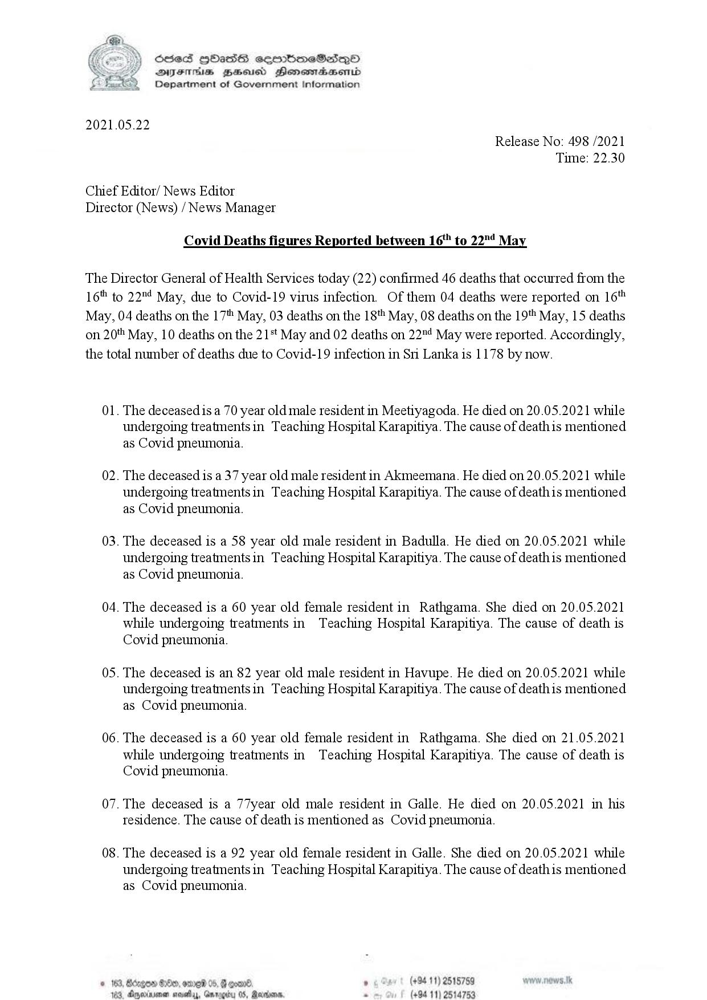

# Press Release - 2021.05.22 - Covid deaths figures reported between 16th to 22nd May 
Key: 1e5a98f4b196c6ad177420ab5ffdfb7a 

---
```
 

Sed Hbass seembmeSese—p©O
DIF BHusd Henemadaenrd
Department of Government Information

2021.05.22

Release No: 498 /2021
Time: 22.30

Chief Editor/ News Editor
Director (News) / News Manager

Covid Deaths figures Reported between 16" to 22"! May

The Director General of Health Services today (22) confirmed 46 deaths that occurred from the
16" to 22"4 May, due to Covid-19 virus infection. Of them 04 deaths were reported on 16"
May, 04 deaths on the 17" May, 03 deaths on the 18" May, 08 deaths on the 19" May, 15 deaths
on 20" May, 10 deaths on the 21't May and 02 deaths on 22"! May were reported. Accordingly,
the total number of deaths due to Covid-19 infection in Sri Lanka is 1178 by now.

Ol.

02.

03.

04.

05.

06.

07.

08.

 

The deceased is a 70 year old male resident in Meetiyagoda. He died on 20.05.2021 while
undergoing treatmentsin Teaching Hospital Karapitiya. The cause of deathis mentioned
as Covid pneumonia.

The deceased is a 37 year old male resident in Akmeemana. He died on 20.05.2021 while
undergoing treatmentsin Teaching Hospital Karapitiya. The cause of deathis mentioned
as Covid pneumonia.

The deceased is a 58 year old male resident in Badulla. He died on 20.05.2021 while
undergoing treatmentsin Teaching Hospital Karapitiya. The cause of deathis mentioned
as Covid pneumonia.

The deceased is a 60 year old female resident in Rathgama. She died on 20.05.2021
while undergoing treatments in Teaching Hospital Karapitiya. The cause of death is
Covid pneumonia.

The deceased is an 82 year old male resident in Havupe. He died on 20.05.2021 while
undergoing treatments in Teaching Hospital Karapitiya. The cause of deathis mentioned
as Covid pneumonia.

The deceased is a 60 year old female resident in Rathgama. She died on 21.05.2021
while undergoing treatments in Teaching Hospital Karapitiya. The cause of death is
Covid pneumonia.

The deceased is a 77year old male resident in Galle. He died on 20.05.2021 in his
tesidence. The cause of death is mentioned as Covid pneumonia.

The deceased is a 92 year old female resident in Galle. She died on 20.05.2021 while
undergoing treatmentsin Teaching Hospital Karapitiya. The cause of deathis mentioned
as Covid pneumonia.

. (+94 11) 2515759
(+94 11) 2514753

```
