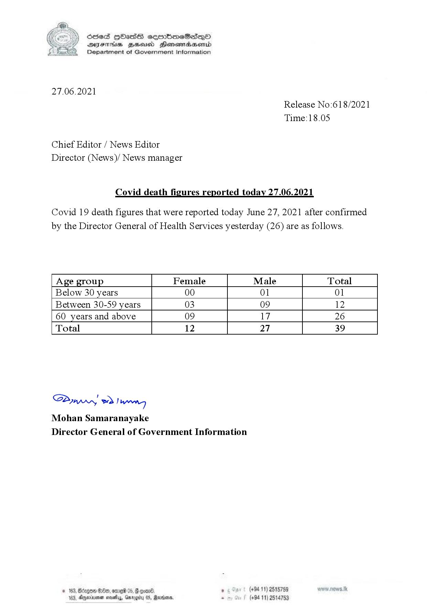

# Press Release - 2021.06.27 - Covid 19 infection deaths 
Key: 1e6834d57bd581a564b8384dd9bb28fa 

---
```
(6 ) SieS HOadS cemmbmeSedqQo
DFTs BHEosd Henewtaeasernid
Department of Government Information

 

27.06.2021
Release No:618/2021
Time:18.05

Chief Editor / News Editor
Director (News)/ News manager

Covid death figures reported today 27.06.2021

Covid 19 death figures that were reported today June 27, 2021 after confirmed
by the Director General of Health Services yesterday (26) are as follows.

 

 

 

 

 

Age group Female Male Total
Below 30 years 00 01 01
Between 30-59 years 03 09 12
60 years and above 09 17 26
Total 12 27 39

 

 

 

 

 

 

SP od Ianwng
Mohan Samaranayake
Director General of Government Information

NED 0 06) . (+94 11) 2515759
44, Gargtty 05, Martone, . (+94 11) 2514753

   

3, Agerniean s

```
