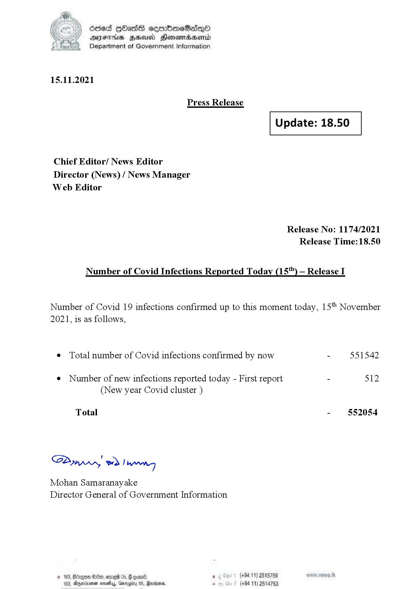

# Press Release - 2021.11.15 
Key: 21a7620da7aa1cca048425d31afd4977 

---
```
L@

)) SOsed Hbads sermbomeSadenoO
AIFS HSA Honomasentd
Department of Government Information

 

15.11.2021

Press Release

 

 

Update: 18.50

 

 

Chief Editor/ News Editor
Director (News) / News Manager
Web Editor

Number of Covid Infections Reported Today (15'") — Release I

Release No: 1174/2021
Release Time: 18.50

Number of Covid 19 infections confirmed up to this moment today, 15" November

2021, is as follows,

¢ Total number of Covid infections confirmed by now

¢ Number of new infections reported today - First report
(New year Covid cluster )

Total

Sa mprn! wd! wong

Mohan Samaranayake
Director General of Government Information

© 163, Bdrgon Ge, ome 05, F
163, Aparna sosehyy, Gnr

oom08) , (+9411) 2515759
05, Rerins. - (+84 11) 25

  

 
 

551542

512

552054

```
