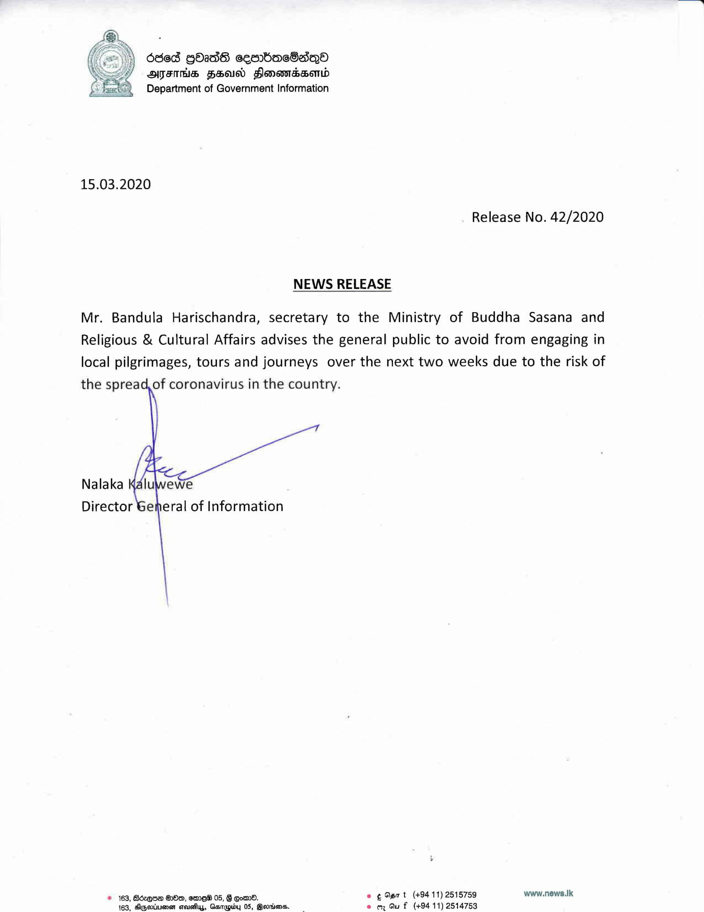

# 15.03.2020 -  press Release 
Key: 21e14f05f04ac4ec31cbeef0823ac457 

---
```
6363 GOadS cesmbaeSadqO
ATES HBO HlonoevrsseMLd
Department of Government Information

 

15.03.2020

Release No. 42/2020

NEWS RELEASE

Mr. Bandula Harischandra, secretary to the Ministry of Buddha Sasana and
Religious & Cultural Affairs advises the general public to avoid from engaging in
local pilgrimages, tours and journeys over the next two weeks due to the risk of
the spread, of coronavirus in the country.

Nalaka
Director General of Information

 

© 163, Bdz@o@ OOo, erme® 05, G Eom. e ¢%a7t (+9411) 2515759 www.news.Ik
163, AGgstwuenen crisis, Garupy 05, @erims. e om Gut (+94 11) 2514753

```
