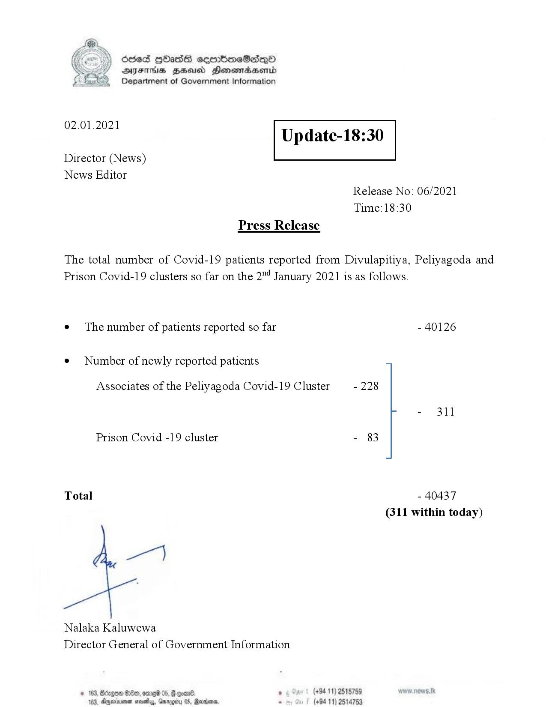

# Press Release - 2021.01.02 
Key: 222940ed5fd0bf16ab8aa9b43672aa6c 

---
```
Ssed HbasG sembmeSadqo
DAIS BHU Honomasentd
Department of Government Information

 

 

02.01.2021

Update-18:30

 

 

 

Director (News)
News Editor
Release No: 06/2021
Time:18:30
Press Release

The total number of Covid-19 patients reported from Divulapitiya, Peliyagoda and
Prison Covid-19 clusters so far on the 2"4 January 2021 is as follows.

e¢ The number of patients reported so far - 40126

¢ Number of newly reported patients

Associates of the Peliyagoda Covid-19 Cluster - 228

Prison Covid -19 cluster - 83

Total - 40437
(311 within today)

Nalaka Kaluwewa
Director General of Government Information

© 163, Borges Ge, ome 05, G goa , (+94 11) 2515759
103, Agere nests, Garogity 0S, Rarens, . (+94 11) 2514759

```
