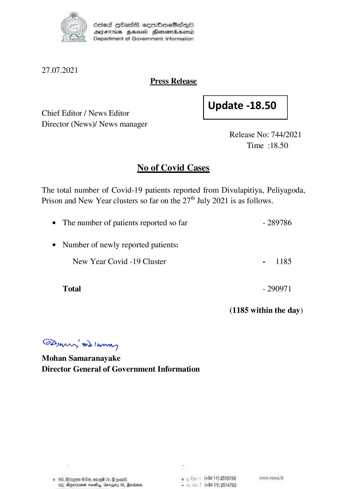

# Press Release - 2021.07.27 
Key: 224fc1c9e9adff4cee4650b000787f60 

---
```
)) Ose HOasdS eommbmeSadqQO
DFtMs HHusd Honemabsentd
Department of Government Information

 

27.07.2021
Press Release

 

Update -18.50

 

 

Chief Editor / News Editor
Director (News)/ News manager

 

Release No: 744/2021
Time :18.50

No of Covid Cases

The total number of Covid-19 patients reported from Divulapitiya, Peliyagoda,
Prison and New Year clusters so far on the 27" July 2021 is as follows.

¢ The number of patients reported so far - 289786
¢ Number of newly reported patients:

New Year Covid -19 Cluster - 1185

Total - 290971

(1185 within the day)

Sw ed Juror
Mohan Samaranayake
Director General of Government Information

© 163, Borgen G0e, oma 05, # ooan®. , (+94 11) 2618759
183, Aetna sesethy, Garogiy 05, Rariana, - (+94 11) 2514753

```
