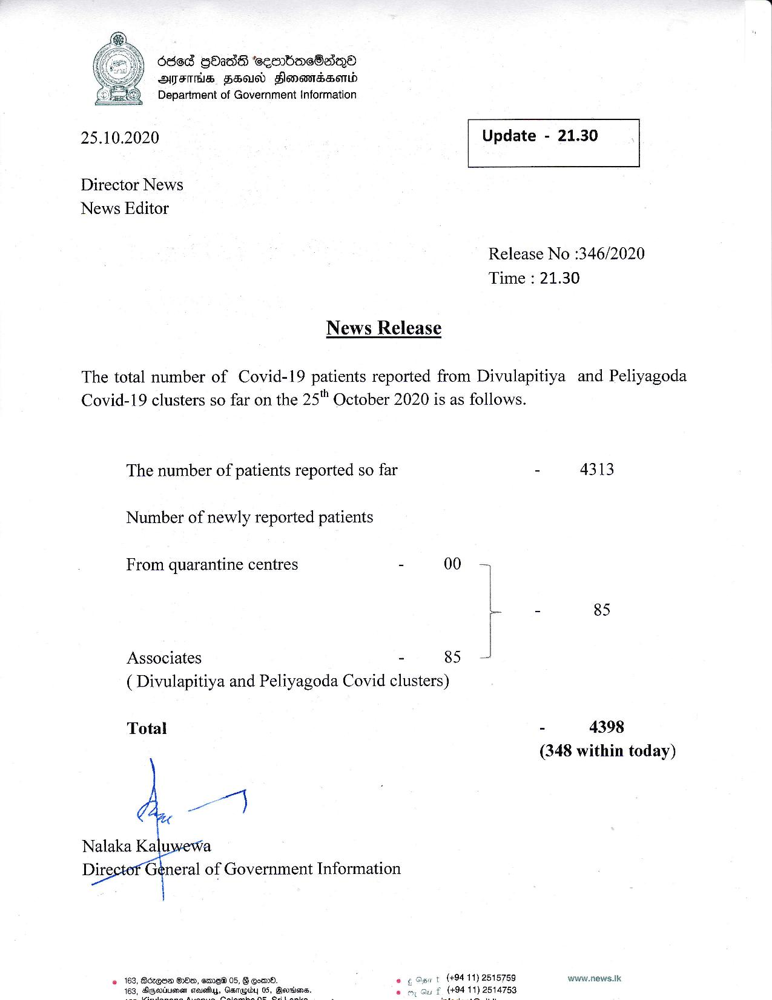

# Press Release - 2020.10.25 
Key: 2281a7c497eac971fe0d6d6623ac1adf 

---
```
6868 Qbas ‘sesrbacBasQ®
OFS FEU Flonamssorwd
Department of Government Information

 

 

25.10.2020 Update - 21.30

 

 

 

Director News
News Editor

Release No :346/2020
Time : 21.30

News Release

The total number of Covid-19 patients reported from Divulapitiya and Peliyagoda
Covid-19 clusters so far on the 25" October 2020 is as follows.

The number of patients reported so far - 4313

Number of newly reported patients

From quarantine centres - 00
L - 85
Associates - 85
( Divulapitiya and Peliyagoda Covid clusters)
Total - 4398

(348 within today)

al

Nalaka Kaluwewa
Dire General of Government Information

 

+ (+94 11) 2518759 www.news.Ik
(494 11) 2514753

 

2 163, Aegon Do, ame 05, G om. © 69

   

```
