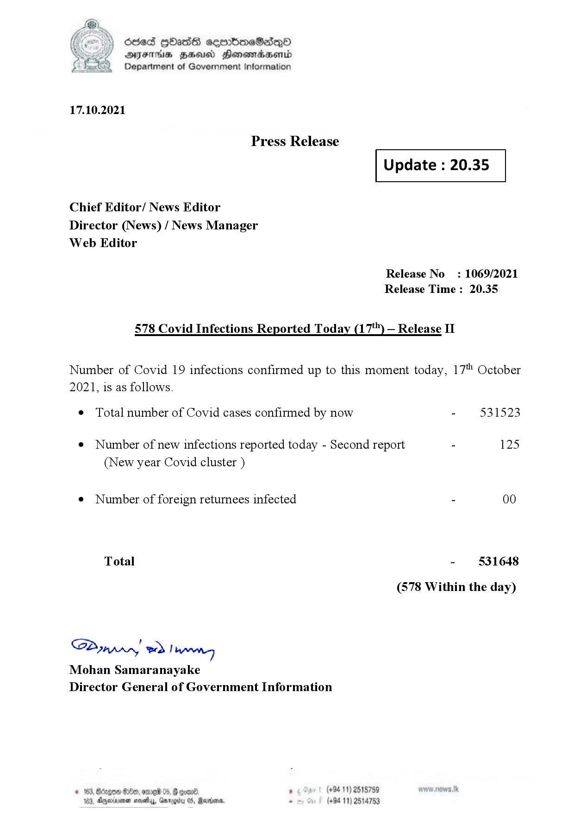

# Press Release  - 2021.10.17 - Covid 19 Infection Report 
Key: 22ba269b0f3cbafe6bd27b9650b71db3 

---
```
dosed GOass eemmbmeSadepO
DFS BHU Honswnradasentd
Department of Government Information

 

 

17.10.2021

Press Release

Chief Editor/ News Editor
Director (News) / News Manager
Web Editor

 

 

Update : 20.35

 

 

Release No

: 1069/2021

Release Time : 20.35

578 Covid Infections Reported Today (17*") — Release II

Number of Covid 19 infections confirmed up to this moment today, 17" October

2021, is as follows.

¢ Total number of Covid cases confirmed by now

¢ Number of new infections reported today - Second report -

(New year Covid cluster )

¢ Number of foreign returnees infected

Total

SP nprrn wd Ianwng
Mohan Samaranayake
Director General of Government Information

 

. (+94 11) 2515759
(+94 11) 2514753

531523

125

00

531648

(578 Within the day)

```
