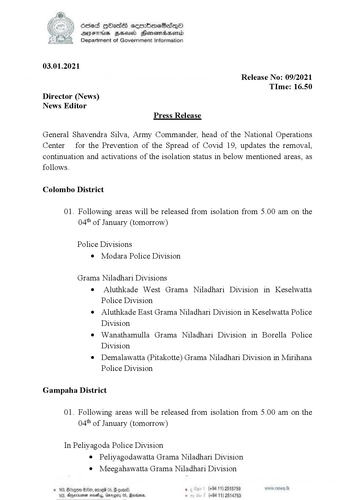

# Press Release - 2021.01.03 - Isolated lifting and newly isolated areas 
Key: 22ca77528661d54447999eb48049e8f2 

---
```
(i) Sed QOadss eeortboeS2dqQ©
2S DYES ZS HonomadsHeonid
Department of Government Information

 

03.01.2021

Release No: 09/2021
TIme: 16.50
Director (News)
News Editor
Press Release

General Shavendra Silva, Army Commander, head of the National Operations
Center for the Prevention of the Spread of Covid 19, updates the removal,
continuation and activations of the isolation status in below mentioned areas, as
follows.

Colombo District

01. Following areas will be released from isolation from 5.00 am on the
04" of January (tomorrow)

Police Divisions
© Modara Police Division

Grama Niladhari Divisions

e Aluthkade West Grama Niladhari Division in Keselwatta
Police Division

e Aluthkade East Grama Niladhari Division in Keselwatta Police
Division

e Wanathamulla Grama Niladhari Division in Borella Police
Division

© Demalawatta (Pitakotte) Grama Niladhari Division in Mirihana
Police Division

Gampaha District

01. Following areas will be released from isolation from 5.00 am on the
04" of January (tomorrow)

In Peliyagoda Police Division
¢ Peliyagodawatta Grama Niladhari Division
¢ Meegahawatta Grama Niladhari Division

© 163, Borgen 800, ome 05, crane ° (+94 11) 2515759
183, Anexnne neethy, Grrogiy 05, Raden. - (+94 11) 2514753

```
