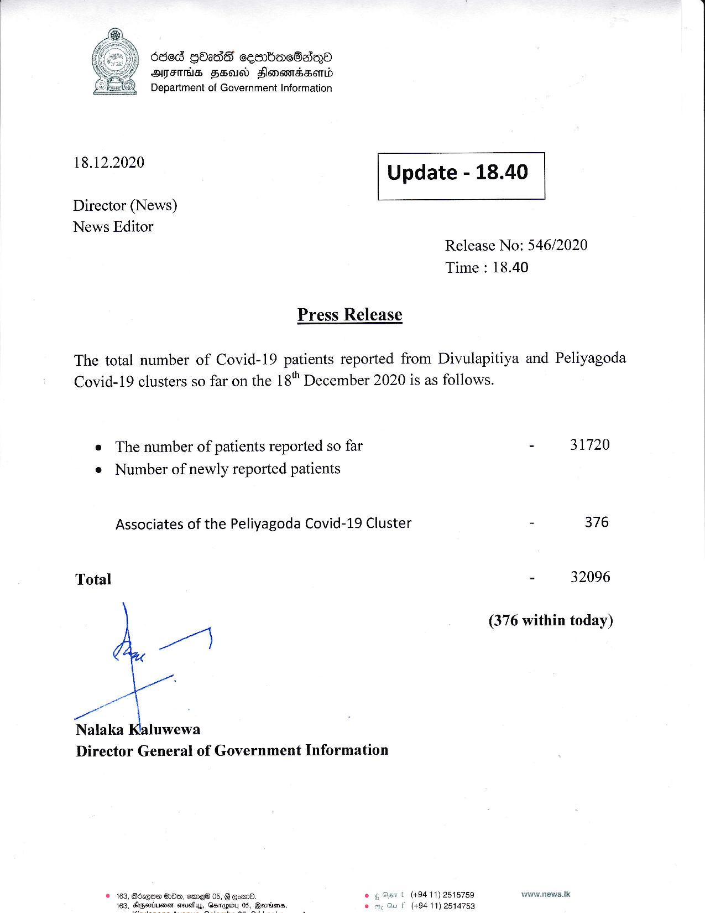

# Press Release - 2020.12.18 
Key: 22f79805bb35d585326dd95789f7eaf7 

---
```
ded GOass ceenbasBsey©
MAME FH Fonandssend
2 Department of Government Information

  

 

18.12.2020 Update - 18.40

Director (News)
News Editor

 

 

 

Release No: 546/2020
Time : 18.40

Press Release

 

The total number of Covid-19 patients reported from Divulapitiya and Peliyagoda |
Covid-19 clusters so far on the 18" December 2020 is as follows. |

e The number of patients reported so far - 31720
e Number of newly reported patients

Associates of the Peliyagoda Covid-19 Cluster - 376

Total - 32096

(376 within today)

P|

Nalaka Kaluwewa

Director General of Government Information

Gan | (49411) 2515759 www.news.tic
f (+94 11) 2514753

© 163, Bcequa Erbe, sme 05, § Goi. os
163, snen atsuaifuy, Gasrpidyy 05, Qarrdons. °

   

```
