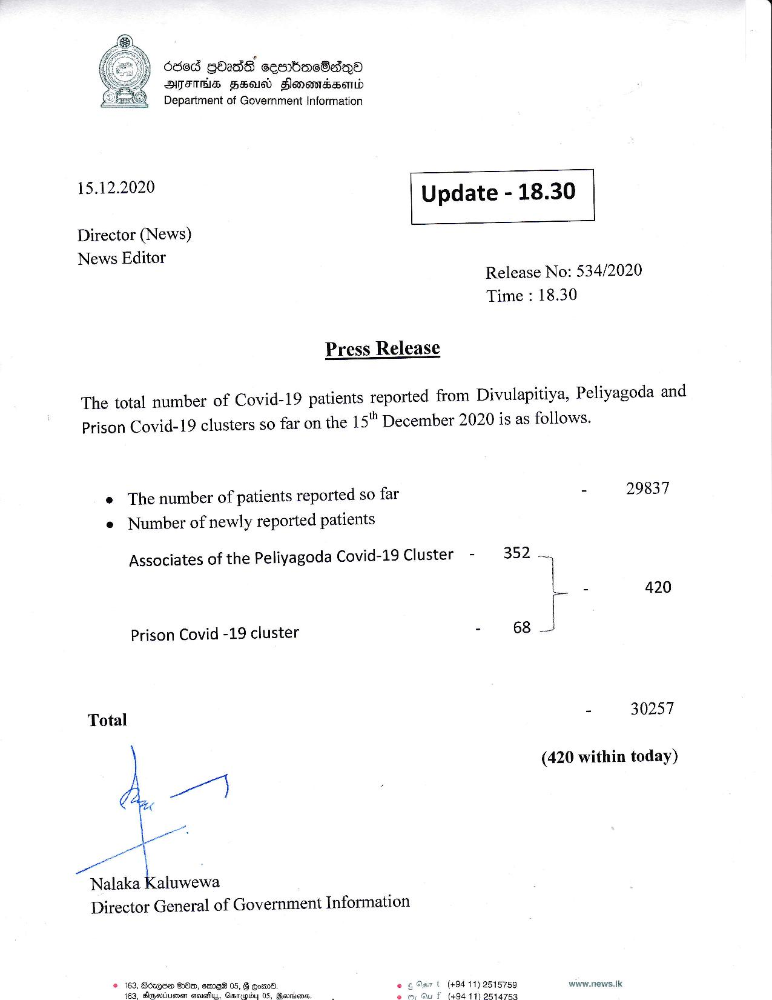

# Press Release - 2020.12.15 -420 Covid 19 infection patients has been reported 
Key: 2354654660ca3376b075681bd094dbce 

---
```
.
6868 Gbass ceenbeacOadqQO
SMITHS FEI Hlonowadserid
Department of Government Information

15.12.2020 Update - 18.30

Director (News)
News Editor

 

 

Release No: 534/2020
Time : 18.30

Press Release

The total number of Covid-19 patients reported from Divulapitiya, Peliyagoda and
Prison Covid-19 clusters so far on the 15" December 2020 is as follows.

e The number of patients reported so far - 29837
e Number of newly reported patients

Associates of the Peliyagoda Covid-19 Cluster - 352 .

|

r - 420

Prison Covid -19 cluster - 6823
Total - 30257
(420 within today)

 

Nalaka Kaluwewa
Director General of Government Information

© 163, Sdxqe GrOe, smaeH 05, B Goer.
465. Gegsotumear cantly. Guanes 65 Menken:

 
 

@ar t (+94 11) 2515759 www.news.lk
f (494 11) 2514753.

```
