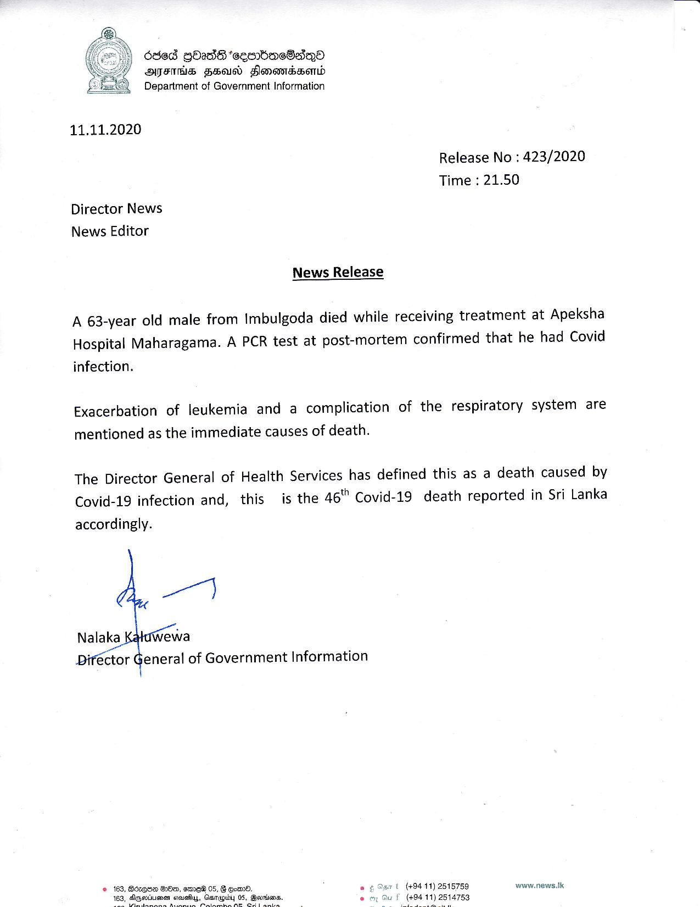

# Press Release - 2020.11.11 -  Covid 19 infection death rises to 46 
Key: 23ae86fdbb2d8da221695da763d25cb7 

---
```
686d gOad*cembac8aqQo
ATS HEU Slonevidsend
Department of Government Information

 

11.11.2020

Release No : 423/2020
Time : 21.50
Director News
News Editor

News Release
A 63-year old male from Imbulgoda died while receiving treatment at Apeksha
Hospital Maharagama. A PCR test at post-mortem confirmed that he had Covid

infection.

Exacerbation of leukemia and a complication of the respiratory system are
mentioned as the immediate causes of death.

The Director General of Health Services has defined this as a death caused by

Covid-19 infection and, this is the 46" Covid-19 death reported in Sri Lanka
accordingly.

a

Nalaka wewa
we
Diréctor General of Government Information

© 163, Bdzeee HO, sine® 05, F Oot. °
ty 8 ss

 

(+94 11) 2515759 www.news.tk
14753

      

```
