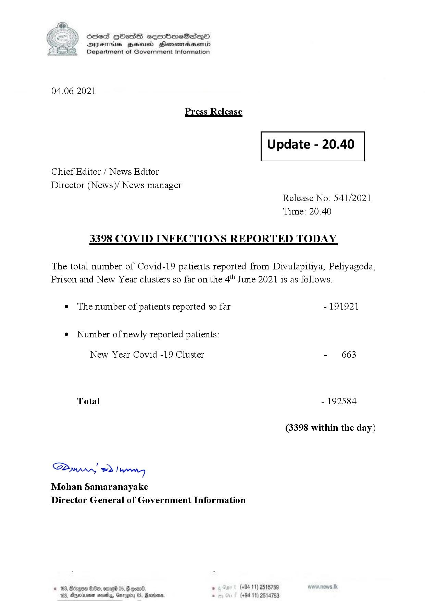

# Press Release - 2021.06.04 - Covid 19 infection report 
Key: 2440344bdbb05fa56b89db51f36d62c4 

---
```
(6 S) ScseS HOasdS cerrbmeSdQo
DFTs BHEosd Henewtaeasernid
Department of Government Information

 

04.06.2021

Press Release

 

Update - 20.40

 

 

 

Chief Editor / News Editor

Director (News)/ News manager
Release No: 541/2021
Time: 20.40

3398 COVID INFECTIONS REPORTED TODAY

The total number of Covid-19 patients reported from Divulapitiya, Peliyagoda,
Prison and New Year clusters so far on the 4" June 2021 is as follows.

e The number of patients reported so far - 191921

¢ Number of newly reported patients:

New Year Covid -19 Cluster - 663
Total - 192584
(3398 within the day)

Saw 2) won,
Mohan Samaranayake
Director General of Government Information

© 163, Bdegon G80, ome 0 6 ’ (+94 11) 2515759
163, Agere naethy, Gmrogiby 05, Rereisons, - (+94 11) 2514753

 

```
