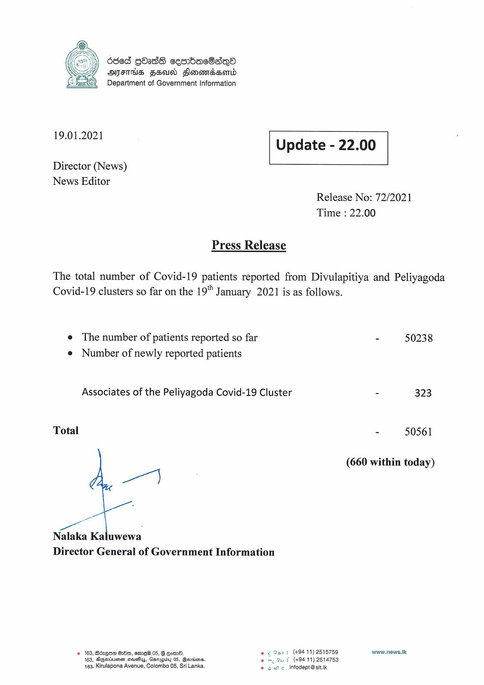

# Press Release - 2021.01.19 
Key: 248f694b140329f3573668a46283c247 

---
```
6sed GOass cesrbKac8sqQo
OMFS FEA Honomaaserd
Department of Government Information

 

 

19.01.2021 Update - 22.00

 

 

 

Director (News)
News Editor
Release No: 72/2021

Time : 22.00

Press Release
The total number of Covid-19 patients reported from Divulapitiya and Peliyagoda

Covid-19 clusters so far on the 19" January 2021 is as follows.

e The number of patients reported so far - 50238
e Number of newly reported patients

Associates of the Peliyagoda Covid-19 Cluster - 323

Total - 50561

(660 within today)

Ce

Nalaka Kaluwewa
Director General of Government Information

© 163, Béxgn2 Om, ema 05, § Goad. © ¢ Sart (+9411) 2515759 www.news.lk
163, DGeriueen seuss, Canupiby 05, Booties. omy Su f (+94 11) 2514753
163, Kirulapona Avenue, Colombo 05, Sri Lanka. ©» we. infodept@sit.ik

```
