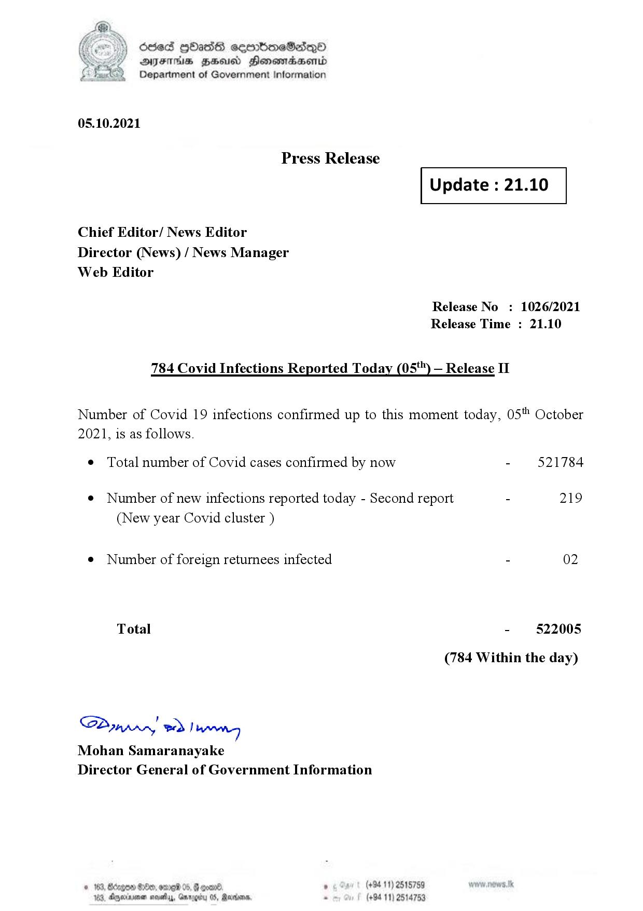

# Press Release  - 2021.10.05 - Covid 19 Infection Report 
Key: 2492ea5e9379698705273b2f61422bbe 

---
```
dosed GOass eemmbmeSadepO
DFS BHU Honswnradasentd
Department of Government Information

 

 

05.10.2021

Press Release

Chief Editor/ News Editor
Director (News) / News Manager
Web Editor

 

 

Update : 21.10

 

 

Release No

Release Time :

784 Covid Infections Reported Today (05*") — Release II

: 1026/2021
21.10

Number of Covid 19 infections confirmed up to this moment today, 05" October

2021, is as follows.

¢ Total number of Covid cases confirmed by now

¢ Number of new infections reported today - Second report -

(New year Covid cluster )

¢ Number of foreign returnees infected

Total

SP nprrn wd Ianwng
Mohan Samaranayake
Director General of Government Information

 

. (+94 11) 2515759
(+94 11) 2514753

521784

219

02

522005

(784 Within the day)

```
