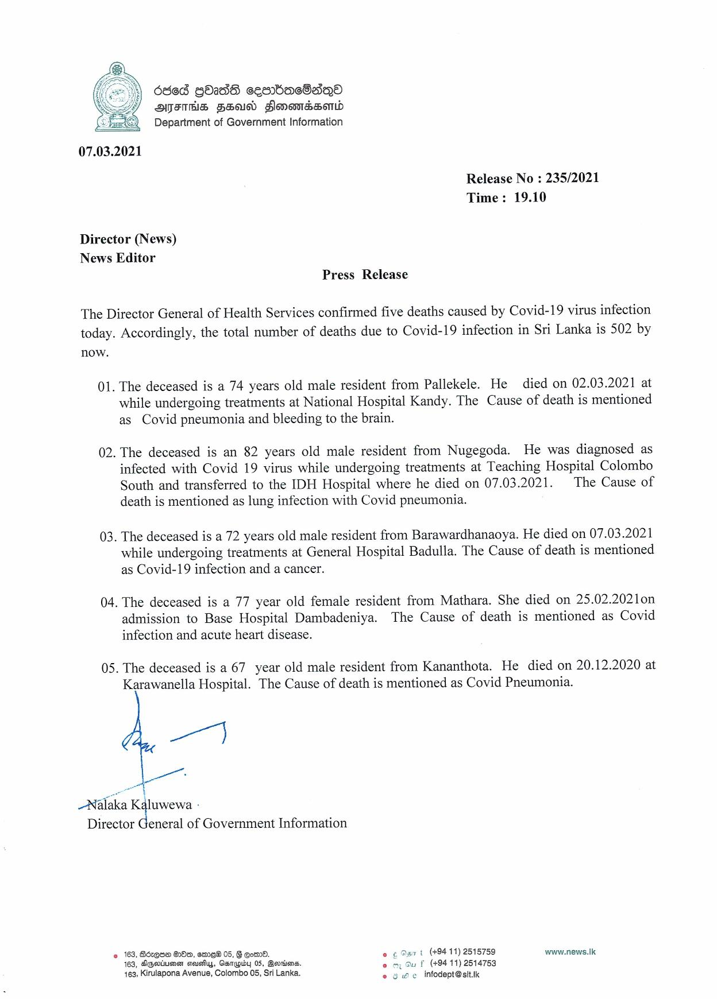

# Press Release - 2021.03.07 - Covid 19 infection deaths 
Key: 2579d3306a7e18d213078e18c66dbf21 

---
```
dded Gb2d8 cesnbacOano
AMFAHS FSU Flonomndssomd
Department of Government Information

 

07.03.2021

Release No : 235/2021
Time: 19.10

Director (News)
News Editor
Press Release

The Director General of Health Services confirmed five deaths caused by Covid-19 virus infection

today. Accordingly, the total number of deaths due to Covid-19 infection in Sri Lanka is 502 by
now.

01. The deceased is a 74 years old male resident from Pallekele. He died on 02.03.2021 at
while undergoing treatments at National Hospital Kandy. The Cause of death is mentioned
as Covid pneumonia and bleeding to the brain.

02. The deceased is an 82 years old male resident from Nugegoda. He was diagnosed as
infected with Covid 19 virus while undergoing treatments at Teaching Hospital Colombo
South and transferred to the IDH Hospital where he died on 07.03.2021. The Cause of
death is mentioned as lung infection with Covid pneumonia.

03. The deceased is a 72 years old male resident from Barawardhanaoya. He died on 07.03.2021
while undergoing treatments at General Hospital Badulla. The Cause of death is mentioned
as Covid-19 infection and a cancer.

04. The deceased is a 77 year old female resident from Mathara. She died on 25.02.2021on

admission to Base Hospital Dambadeniya. The Cause of death is mentioned as Covid
infection and acute heart disease.

05. The deceased is a 67 year old male resident from Kananthota. He died on 20.12.2020 at
Karawanella Hospital. The Cause of death is mentioned as Covid Pneumonia.

ay

a |
-Nalaka = al :

Director General of Government Information

2 163, Screen Oo, emeW 05, G Eom.
163, Agsrimeen seusiys, Ganqgiby 05, Bertions.
163, Kirulapona Avenue, Colombo 05, Sri Lanka.

Sar t (494-11) 2518759 www.news.lk
uf (494 11) 2514753
6 € infodept@sit.k

  

```
