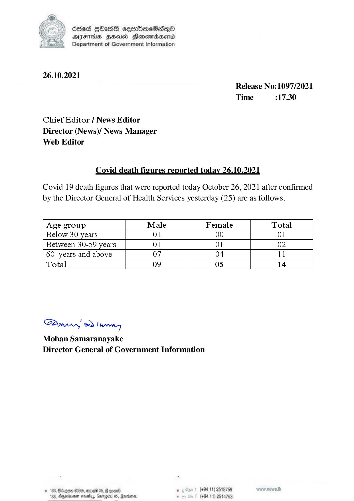

# Press Release - 2021.10.26 - Covid 19 Infection Report 
Key: 25cc7f648c7a7aa136df38df11e7bc42 

---
```
) dese HOadS seerboeSiqQo
AIFS FHA Honomasenid
Department of Government information

 

26.10.2021

Chief Editor / News Editor

Director (News)/ News Manager
Web Editor

Release No:1097/2021
Time 317.30

Covid death figures reported today 26.10.2021

Covid 19 death figures that were reported today October 26, 2021 after confirmed
by the Director General of Health Services yesterday (25) are as follows.

 

 

 

 

 

 

 

 

Age group Male Female Total
Below 30 years 01 00 01
Between 30-59 years Ol Ol 02
60 years and above 07 04 11
Total 09 0s 14

 

 

 

Saw eo) wn
Mohan Samaranayake
Director General of Government Information

 

#163, Bdegon S180, anne 05, & goane . (+94 11) 2518759
183, Ageia savy, Gnrogiru 05, Rares - (+94 11) 2514753

```
