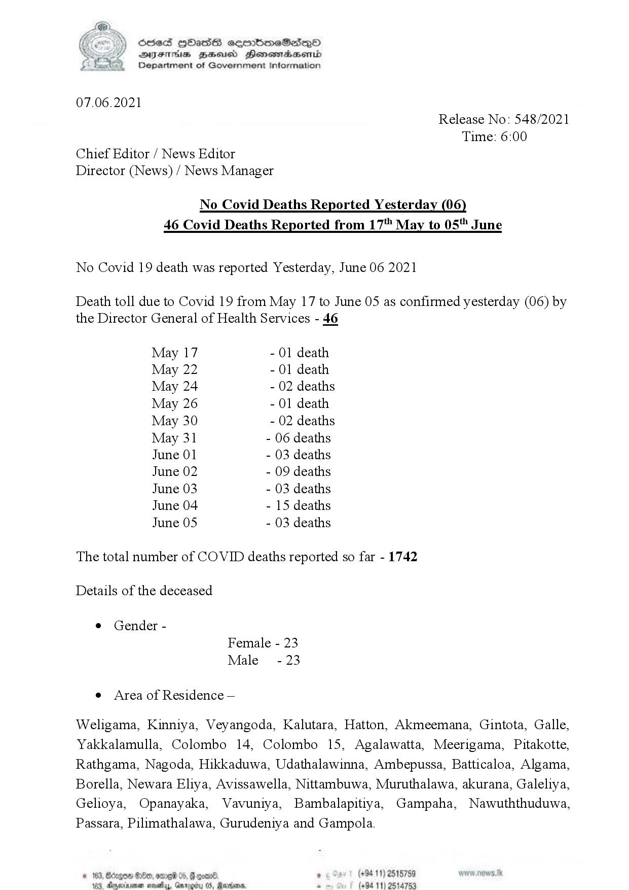

# Press Release - 2021.06.07 - Covid 19 infection deaths report yesterday 
Key: 25fa735d7355020e34644fd9184c8f84 

---
```
| Scied HObasS sermimeSesqQoO
SVYsEThs BHsusd Henemadasemid
Department of Government Information

 

07.06.2021
Release No: 548/2021
Time: 6:00
Chief Editor / News Editor
Director (News) / News Manager

No Covid Deaths Reported Yesterday (06)
46 Covid Deaths Reported from 17 May to 05" June

No Covid 19 death was reported Yesterday, June 06 2021

Death toll due to Covid 19 from May 17 to June 05 as confirmed yesterday (06) by
the Director General of Health Services - 46

May 17 - 01 death
May 22 - 01 death
May 24 - 02 deaths
May 26 - 01 death
May 30 - 02 deaths
May 31 - 06 deaths
June 01 - 03 deaths
June 02 - 09 deaths
June 03 - 03 deaths
June 04 - 15 deaths
June 05 - 03 deaths

The total number of COVID deaths reported so far - 1742
Details of the deceased

© Gender -
Female - 23
Male - 23

e Area of Residence —

Weligama, Kinniya, Veyangoda, Kalutara, Hatton, Akmeemana, Gintota, Galle,
Yakkalamulla, Colombo 14, Colombo 15, Agalawatta, Meerigama, Pitakotte,
Rathgama, Nagoda, Hikkaduwa, Udathalawinna, Ambepussa, Batticaloa, Algama,
Borella, Newara Eliya, Avissawella, Nittambuwa, Muruthalawa, akurana, Galeliya,
Gelioya, Opanayaka, Vavuniya, Bambalapitiya, Gampaha, Nawuththuduwa,
Passara, Pilimathalawa, Gurudeniya and Gampola.

© 163, Bdzgoe #89, ome 05, @ ooo ° (+94 11) 2515759
1, dnwiimen (494 11) 4

   

    

```
