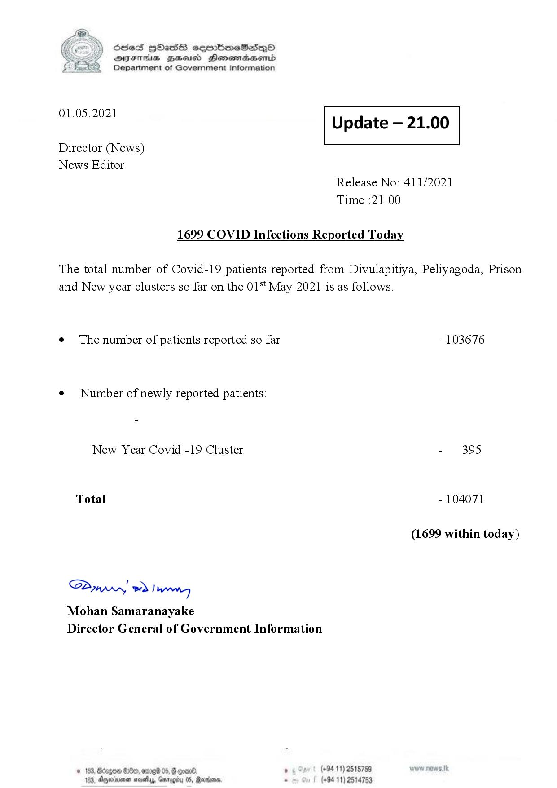

# Press Release - 2021.05.01 
Key: 2603708ca36649e1f229c34200cea667 

---
```
S) ScseS HOasdS cerrbmeSdQo
DFTs BHEosd Henewtaeasernid
Department of Government Information

 

 

01.05.2021 Update — 21.00

 

 

 

Director (News)

News Editor
Release No: 411/2021
Time :21.00

1699 COVID Infections Reported Today
The total number of Covid-19 patients reported from Divulapitiya, Peliyagoda, Prison
and New year clusters so far on the 01*t May 2021 is as follows.

e¢ The number of patients reported so far - 103676

e¢ Number of newly reported patients:

New Year Covid -19 Cluster - 395
Total - 104071
(1699 within today)

Saw o> Danny
Mohan Samaranayake
Director General of Government Information

. (+94 11) 2515789
(+94 11) 25

   

G08 B80, ODED 05, G 90000
Agjerinimen noisy, Garages

   

```
