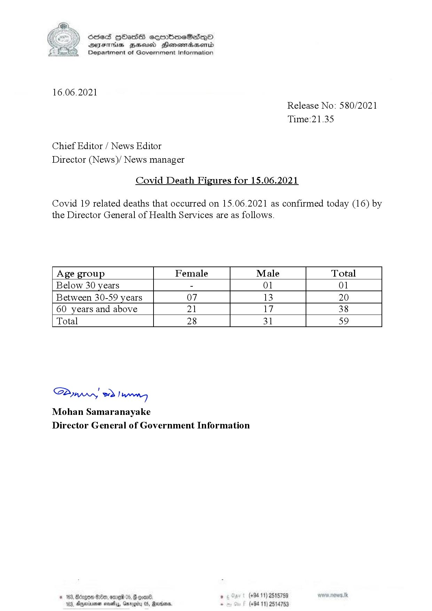

# Press Release - 2021.06.16 - Covid 19 infection deaths 
Key: 260e46925034b39306f1079baa27bff7 

---
```
(6 S) ScseS HOasdS cerrbmeSdQo
DFTs BHEosd Henewtaeasernid
Department of Government Information

 

16.06.2021
Release No: 580/2021
Time:21.35

Chief Editor / News Editor
Director (News)/ News manager

Covid Death Figures for 15.06.2021

Covid 19 related deaths that occurred on 15.06.2021 as confirmed today (16) by
the Director General of Health Services are as follows.

 

 

 

 

 

 

 

 

 

Age group Female Male Total
Below 30 years - 01 01
Between 30-59 years 07 13 20
60 years and above 21 17 38
Total 28 31 59

 

 

SAmwwy 2) wong
Mohan Samaranayake
Director General of Government Information

. (+94 11) 2515759
(+94 11) 2514753

 

© 163, Bdzgoa Oe, ome 05,

163, Dnexirsonan novellas, Gn

 

```
