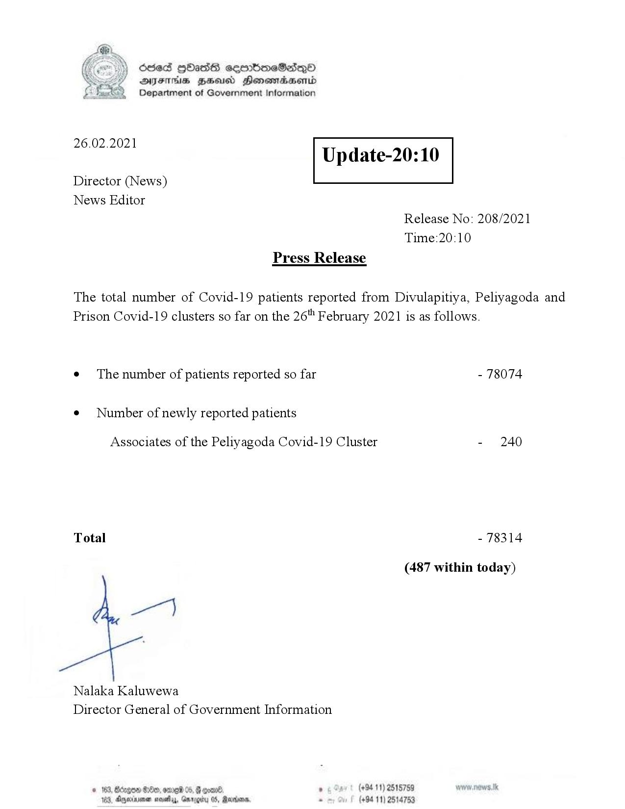

# Press Release - 2021.02.26 
Key: 26311f9789312760aa288210d353b346 

---
```
Ssed HbasG sembmeSadqo
DAIS BHU Honomasentd
Department of Government Information

 

 

26.02.2021

Update-20:10

 

 

 

Director (News)
News Editor
Release No: 208/2021
Time:20:10
Press Release

The total number of Covid-19 patients reported from Divulapitiya, Peliyagoda and
Prison Covid-19 clusters so far on the 26" February 2021 is as follows.
e¢ The number of patients reported so far - 78074

¢ Number of newly reported patients

Associates of the Peliyagoda Covid-19 Cluster - 240

Total - 78314

(487 within today)

yen)

Nalaka Kaluwewa
Director General of Government Information

° (+94 11) 2515759
(+94 11) 2514753

© 163, Bdegon G0e, ome 05, G com
188, Agjerinenen mosetay, Garp

  

```
