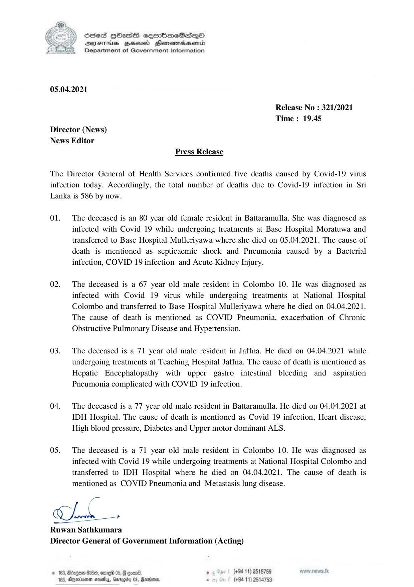

# Press Release - 2021.04.05 - Covid 19 infection deaths 
Key: 276f5e6b19975ac61579dd3a8de4104b 

---
```
 

6856S HHass sermbmeSasqo
DFTs BHEosd Henewtaeasernid
Department of Government Information

05.04.2021

Release No : 321/2021
Time : 19.45

Director (News)
News Editor

Press Release

The Director General of Health Services confirmed five deaths caused by Covid-19 virus
infection today. Accordingly, the total number of deaths due to Covid-19 infection in Sri
Lanka is 586 by now.

Ol.

02.

03.

04.

05.

The deceased is an 80 year old female resident in Battaramulla. She was diagnosed as
infected with Covid 19 while undergoing treatments at Base Hospital Moratuwa and
transferred to Base Hospital Mulleriyawa where she died on 05.04.2021. The cause of
death is mentioned as septicaemic shock and Pneumonia caused by a Bacterial
infection, COVID 19 infection and Acute Kidney Injury.

The deceased is a 67 year old male resident in Colombo 10. He was diagnosed as
infected with Covid 19 virus while undergoing treatments at National Hospital
Colombo and transferred to Base Hospital Mulleriyawa where he died on 04.04.2021.
The cause of death is mentioned as COVID Pneumonia, exacerbation of Chronic
Obstructive Pulmonary Disease and Hypertension.

The deceased is a 71 year old male resident in Jaffna. He died on 04.04.2021 while
undergoing treatments at Teaching Hospital Jaffna. The cause of death is mentioned as
Hepatic Encephalopathy with upper gastro intestinal bleeding and aspiration
Pneumonia complicated with COVID 19 infection.

The deceased is a 77 year old male resident in Battaramulla. He died on 04.04.2021 at
IDH Hospital. The cause of death is mentioned as Covid 19 infection, Heart disease,
High blood pressure, Diabetes and Upper motor dominant ALS.

The deceased is a 71 year old male resident in Colombo 10. He was diagnosed as
infected with Covid 19 while undergoing treatments at National Hospital Colombo and
transferred to IDH Hospital where he died on 04.04.2021. The cause of death is
mentioned as COVID Pneumonia and Metastasis lung disease.

ee

Conde +

 

Ruwan Sathkumara
Director General of Government Information (Acting)

© 163, Bdngoe 200, ome 05, G goad. . (+94 11) 2515759 wow. news. tk
163, Aperture neath, Garogiry 05, Ranma - (+94 11) 2514753

```
