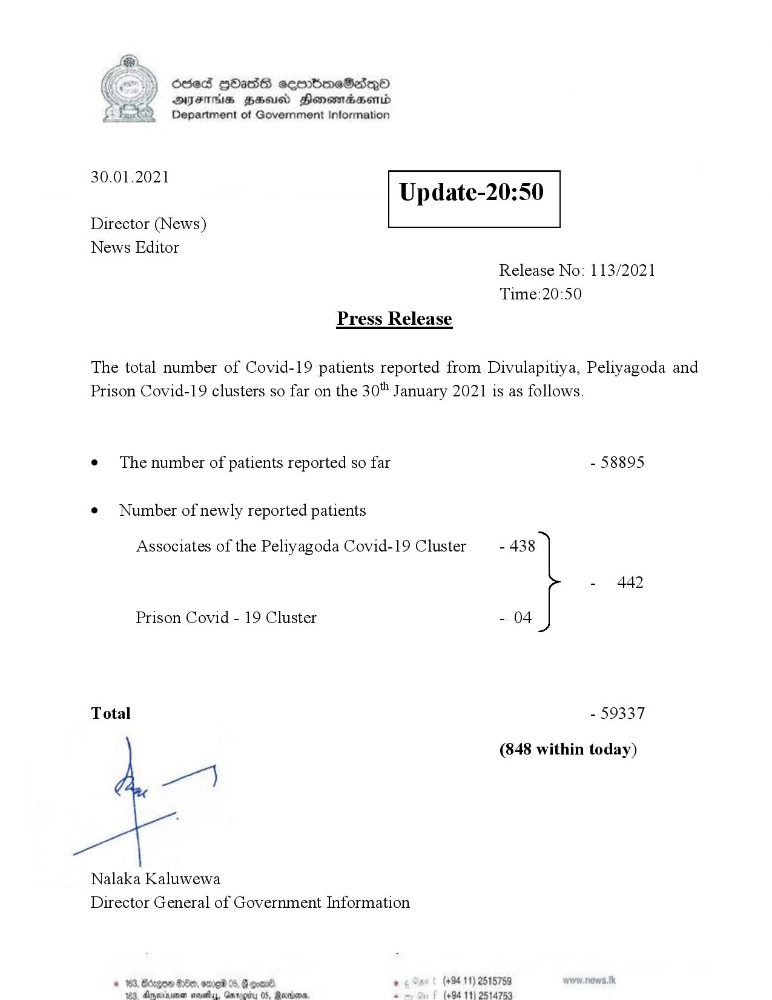

# Press Release - 2021.01.30 
Key: 285f64eb2e8d49ba0bae8eb67575f361 

---
```
>) Sed HOadS ceorbmeSedeQ®
DAIS BHU Honomasentd
Department of Government Information

 

 

30.01.2021

Update-20:50

 

 

 

Director (News)
News Editor
Release No: 113/2021
Time:20:50
Press Release

The total number of Covid-19 patients reported from Divulapitiya, Peliyagoda and
Prison Covid-19 clusters so far on the 30" January 2021 is as follows.
e¢ The number of patients reported so far - 58895

¢ Number of newly reported patients

Associates of the Peliyagoda Covid-19 Cluster - 438

- 442
Prison Covid - 19 Cluster - 04
Total - 59337
(848 within today)

ey

Nalaka Kaluwewa
Director General of Government Information

’ (+94 11) 2515759
‘@axbms. : (494 11) 2514753

 
  

© 163, Bdge GOe, ome 05, G oom,
183 Xnenen sevettay, Garage

  

```
