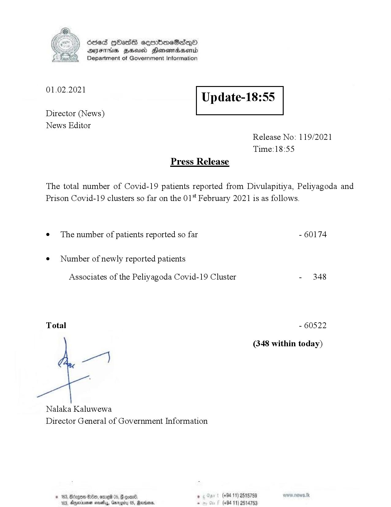

# Press Release - 2021.02.01 
Key: 286ffe0947187f6ae0fe6cdc285bf71f 

---
```
Ssed HbasG sembmeSadqo
DAIS BHU Honomasentd
Department of Government Information

 

 

01.02.2021

Update-18:55

 

 

 

Director (News)
News Editor
Release No: 119/2021
Time:18:55
Press Release

The total number of Covid-19 patients reported from Divulapitiya, Peliyagoda and
Prison Covid-19 clusters so far on the 01" February 2021 is as follows.
e¢ The number of patients reported so far - 60174

¢ Number of newly reported patients

Associates of the Peliyagoda Covid-19 Cluster - 348

Total - 60522

(348 within today)

per}

Nalaka Kaluwewa
Director General of Government Information

   

Bed, OmrNS 05, G gone. . (+94 11) 2515759
103, Ageinenen mosey, Garg 05, Martie s (+94 11) 2514753

 

```
