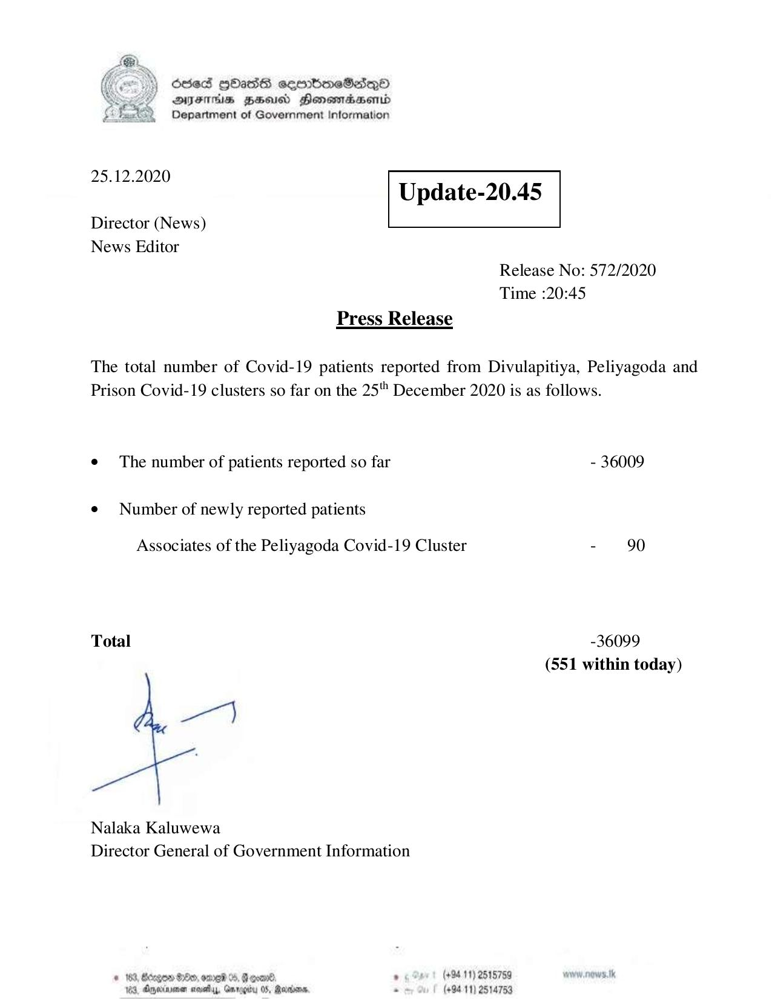

# Press Release - 2020.12.25 
Key: 2898f4bb405bdda9a62a9a62b229e4f6 

---
```
6563 HOHasG sembmcSasqQo
DAJFITAs BHU Honomrdbsertd
Department of Government Information

 

 

25.12.2020
Update-20.45

 

 

 

Director (News)
News Editor

Release No: 572/2020

Time :

Press Release

20:45

The total number of Covid-19 patients reported from Divulapitiya, Peliyagoda and

Prison Covid-19 clusters so far on the 25" December 2020 is as

¢ The number of patients reported so far

¢ Number of newly reported patients

Associates of the Peliyagoda Covid-19 Cluster

Total

Nalaka Kaluwewa
Director General of Government Information

© 183, Bcegon Ge, omed 0, § coanl: , (+9411) 2515759
103, Aneiawmen covey, Gmrogiby 05, Rares, - (+9411) 2514753

follows.

- 36009

-36099
(551 within today)

```
