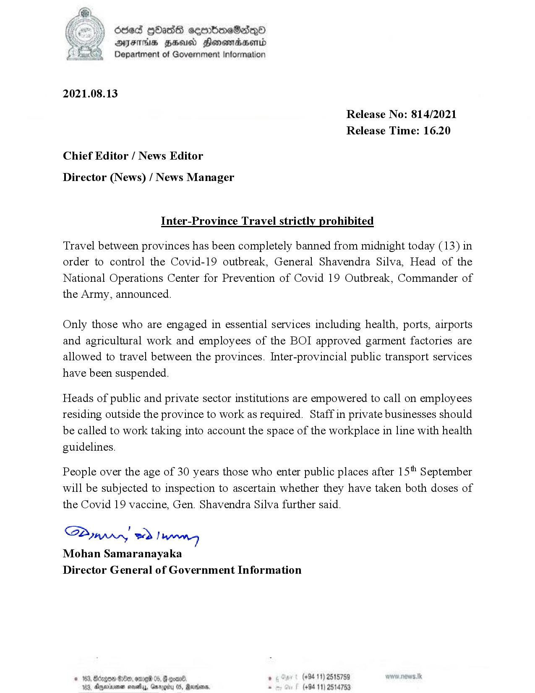

# Press Release  - 2021.08.13 - Inter - Province Travel strictly prohibited 
Key: 28c7e66b834a5be76906d9a92369e614 

---
```
663 GOasS cemmbioeSaqQo
AJFTHS HSU Honomadsend
“2 Department of Government Information

 

2021.08.13

Release No: 814/2021
Release Time: 16.20

Chief Editor / News Editor
Director (News) / News Manager

Inter-Province Travel strictly prohibited

Travel between provinces has been completely banned from midnight today (13) in
order to control the Covid-19 outbreak, General Shavendra Silva, Head of the
National Operations Center for Prevention of Covid 19 Outbreak, Commander of
the Army, announced.

Only those who are engaged in essential services including health, ports, airports
and agricultural work and employees of the BOI approved garment factories are
allowed to travel between the provinces. Inter-provincial public transport services
have been suspended.

Heads of public and private sector institutions are empowered to call on employees
residing outside the province to work as required. Staff in private businesses should
be called to work taking into account the space of the workplace in line with health
guidelines.

People over the age of 30 years those who enter public places after 15" September
will be subjected to inspection to ascertain whether they have taken both doses of
the Covid 19 vaccine, Gen. Shavendra Silva further said.

SPynprn, ed Nannon
Mohan Samaranayaka
Director General of Government Information

gon B80, ome 05, @ goen8. ’ (+94 11) 2515759
23, Armaan soay, Gnrogiy 05, Rains. = (+94 11) 2514753

   

```
