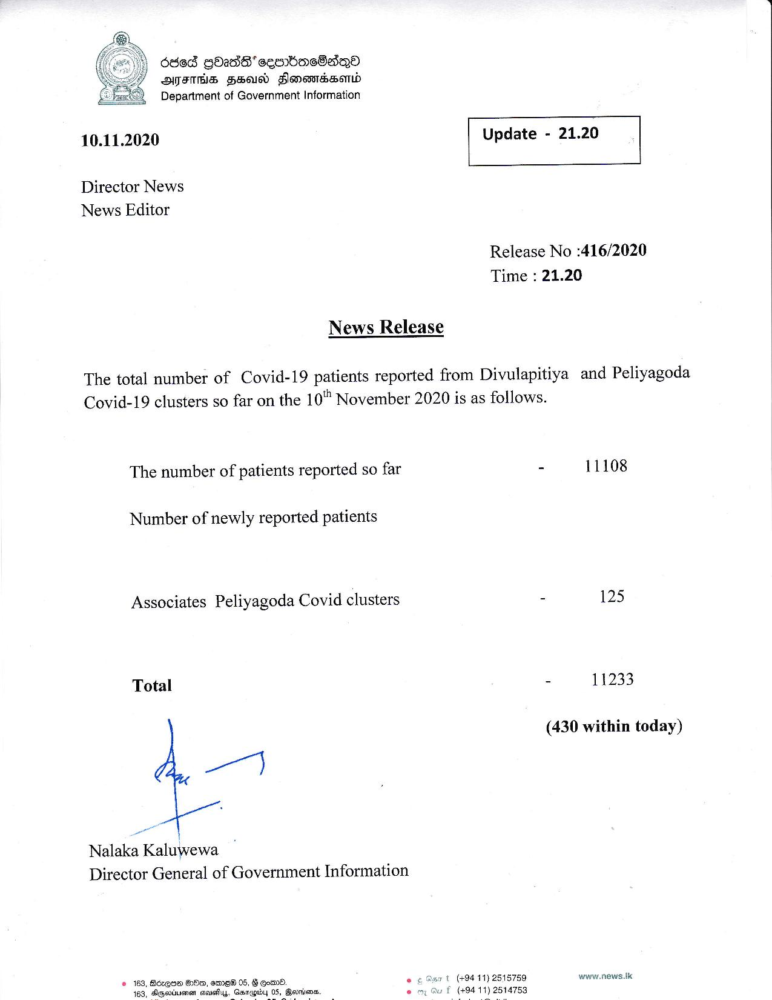

# Press Release - 2020.11.10 
Key: 28d4f446e248770bdb0ecfb90510da4b 

---
```
ded GOadS cembnc8adqQo
AIFS SHAS Honewnessonid
Department of Government Information

 

 

10.11.2020 Update - 21.20

 

 

 

Director News
News Editor

Release No :416/2020
Time : 21.20

News Release

The total number of Covid-19 patients reported from Divulapitiya and Peliyagoda
Covid-19 clusters so far on the 10" November 2020 is as follows.

The number of patients reported so far - 11108

Number of newly reported patients

Associates Peliyagoda Covid clusters - 125

Total - 11233

(430 within today)

ail

Nalaka Kaluwewa
Director General of Government Information

t (+94 11) 2515759 www.news.tk
(494 11) 2614753

© 163, Bdzesm BOs, emreG 05, § goad.
463, Agarinsnen ciuatiyy, Gasnapiby 05, Goris

  

 

```
