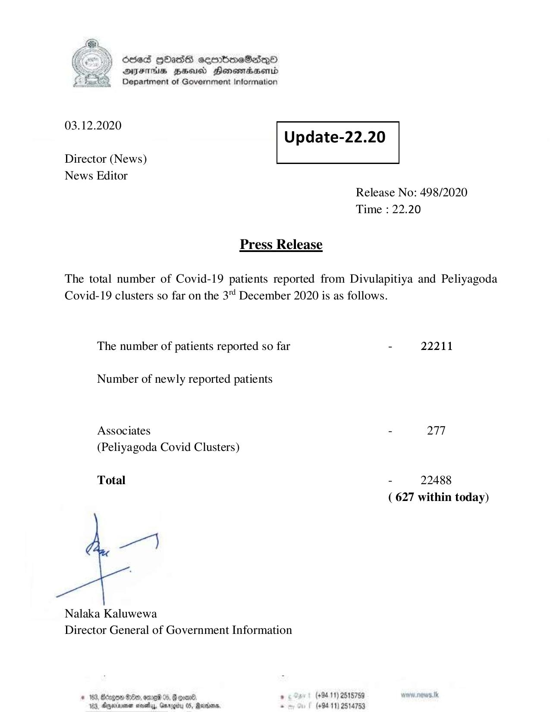

# Press Release - 2020.12.03 
Key: 2997a3ae7eb6eeef1c90722c6a339f70 

---
```
6563 HOHasG sembmcSasqQo
DAJFITAs BHU Honomrdbsertd
Department of Government Information

 

 

03.12.2020
Update-22.20

 

 

Director (News)
News Editor

 

Release No: 498/2020
Time : 22.20

Press Release
The total number of Covid-19 patients reported from Divulapitiya and Peliyagoda
Covid-19 clusters so far on the 3" December 2020 is as follows.
The number of patients reported so far - 22211
Number of newly reported patients
Associates - 277
(Peliyagoda Covid Clusters)

Total - 22488
( 627 within today)

oe)

Nalaka Kaluwewa
Director General of Government Information

# 169, Bcegem 80, ore 04, Foal , (494.11) 2515759 MOREE
163, Ageia sve, Grrogby 05, Maxson, * (+9411) 2514753

```
