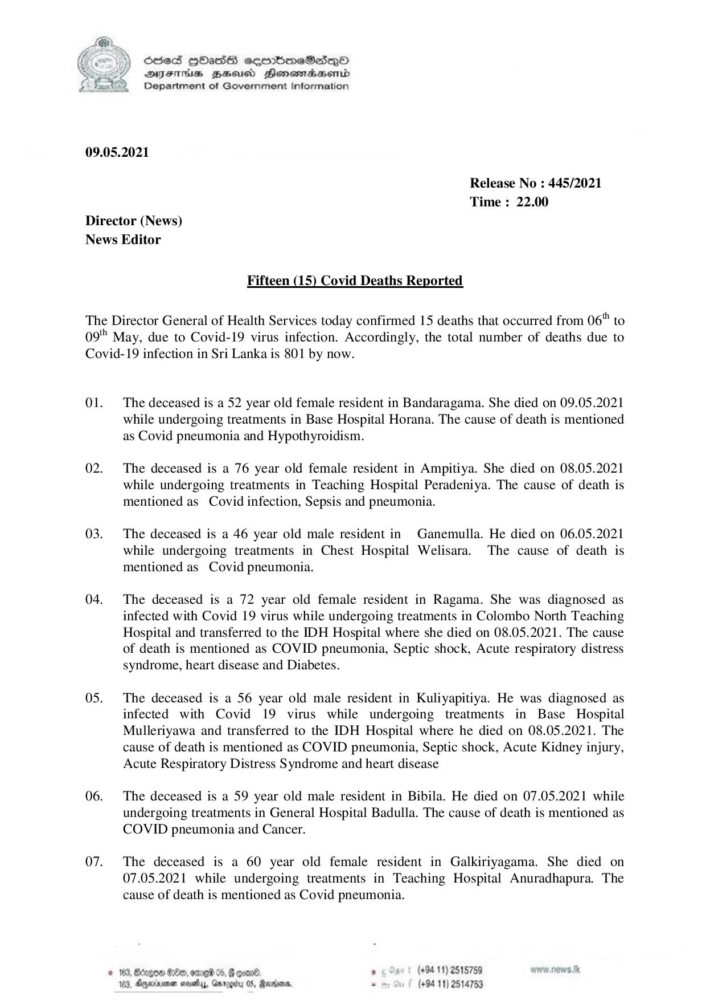

# Press Release - 2021.05.09 - Covid 19 Infection deaths 
Key: 29e0d0c5092415c3a7df4740617916a4 

---
```
 

6856S HHass sermbmeSasqo
DFTs BHEosd Henewtaeasernid
Department of Government Information

09.05.2021

Release No : 445/2021
Time : 22.00

Director (News)
News Editor

Fifteen (15) Covid Deaths Reported

The Director General of Health Services today confirmed 15 deaths that occurred from 06" to
oot May, due to Covid-19 virus infection. Accordingly, the total number of deaths due to
Covid-19 infection in Sri Lanka is 801 by now.

Ol.

02.

03.

04.

0S.

06.

07.

The deceased is a 52 year old female resident in Bandaragama. She died on 09.05.2021
while undergoing treatments in Base Hospital Horana. The cause of death is mentioned
as Covid pneumonia and Hypothyroidism.

The deceased is a 76 year old female resident in Ampitiya. She died on 08.05.2021
while undergoing treatments in Teaching Hospital Peradeniya. The cause of death is
mentioned as Covid infection, Sepsis and pneumonia.

The deceased is a 46 year old male resident in Ganemulla. He died on 06.05.2021
while undergoing treatments in Chest Hospital Welisara. The cause of death is
mentioned as Covid pneumonia.

The deceased is a 72 year old female resident in Ragama. She was diagnosed as
infected with Covid 19 virus while undergoing treatments in Colombo North Teaching
Hospital and transferred to the IDH Hospital where she died on 08.05.2021. The cause
of death is mentioned as COVID pneumonia, Septic shock, Acute respiratory distress
syndrome, heart disease and Diabetes.

The deceased is a 56 year old male resident in Kuliyapitiya. He was diagnosed as
infected with Covid 19 virus while undergoing treatments in Base Hospital
Mulleriyawa and transferred to the IDH Hospital where he died on 08.05.2021. The
cause of death is mentioned as COVID pneumonia, Septic shock, Acute Kidney injury,
Acute Respiratory Distress Syndrome and heart disease

The deceased is a 59 year old male resident in Bibila. He died on 07.05.2021 while
undergoing treatments in General Hospital Badulla. The cause of death is mentioned as
COVID pneumonia and Cancer.

The deceased is a 60 year old female resident in Galkiriyagama. She died on
07.05.2021 while undergoing treatments in Teaching Hospital Anuradhapura. The
cause of death is mentioned as Covid pneumonia.

© 163, Bdngon $0, ome 05, G coand. . (+94 11) 2515759 wow .nows.tk
103, Ayexrne masety, Gurogiy 05, Rerdans, - (+94 11) 2514753

```
