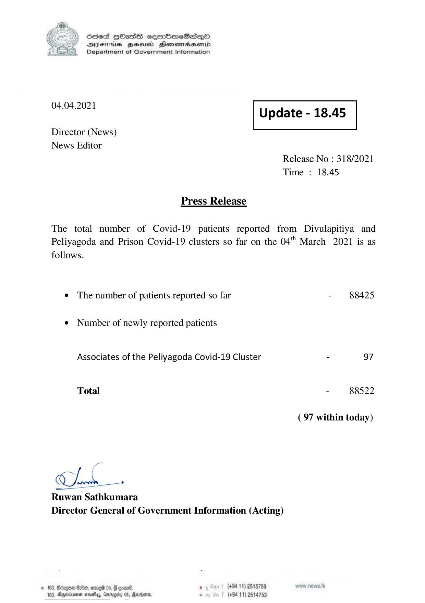

# Press Release - 2021.04.04 
Key: 2a7b44bf5e89fbd63489fc30e8fd8683 

---
```
) ScdeS HOadS cermbmeSsdQo
DVEFIHS HHosd Honomabsenid
Department of Government Information

 

 

04.04.2021

 

Update - 18.45

 

 

Director (News)
News Editor

Release No : 318/2021
Time : 18.45

Press Release

The total number of Covid-19 patients reported from Divulapitiya and
Peliyagoda and Prison Covid-19 clusters so far on the 04" March 2021 is as

follows.

¢ The number of patients reported so far

¢ Number of newly reported patients
Associates of the Peliyagoda Covid-19 Cluster

Total

—

Ok oe

Ruwan Sathkumara
Director General of Government Information (Acting)

© 163, Béagee 09, ome 05, # con®, , (+94 11) 2515759
163, Dperinmean nese, Gurogiry 05, Rarwans - (+94 11) 2514753

- 88425

- 88522

(97 within today)

```
