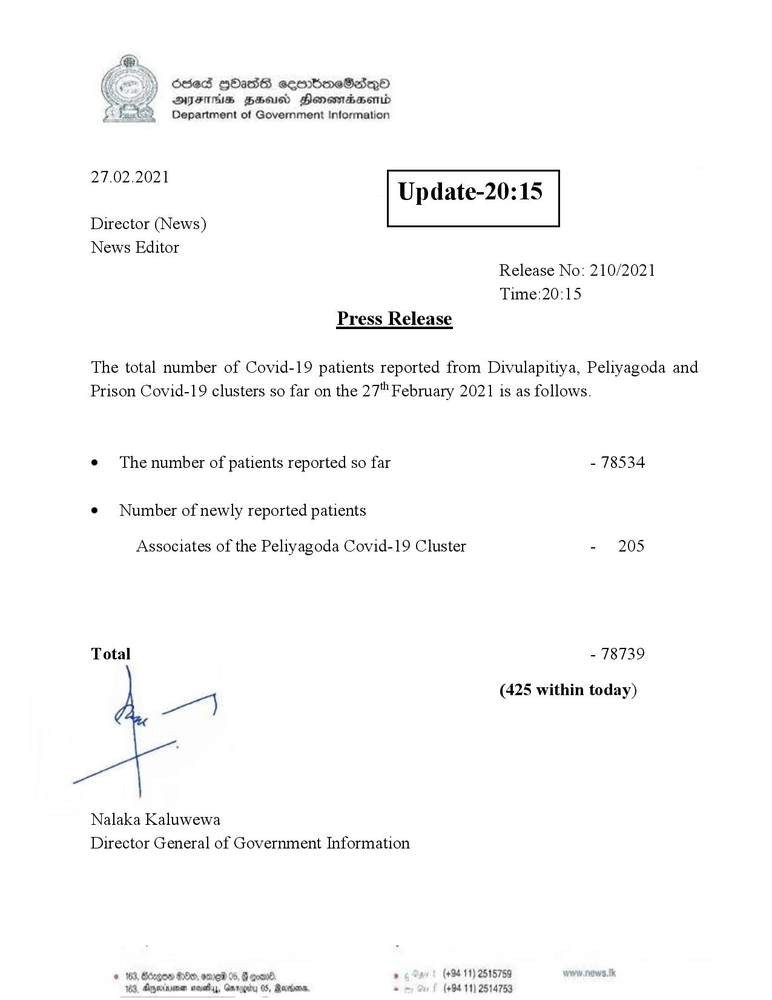

# Press Release - 2021.02.27 
Key: 2adbc58ffe03c68d32df5541076062d1 

---
```
Ssed HbasG sembmeSadqo
DAIS BHU Honomasentd
Department of Government Information

 

 

27.02.2021

Update-20:15

 

 

 

Director (News)
News Editor
Release No: 210/2021
Time:20:15
Press Release

The total number of Covid-19 patients reported from Divulapitiya, Peliyagoda and
Prison Covid-19 clusters so far on the 27" February 2021 is as follows.
e¢ The number of patients reported so far - 78534

¢ Number of newly reported patients

Associates of the Peliyagoda Covid-19 Cluster - 205
Total - 78739
we (425 within today)
Nalaka Kaluwewa
Director General of Government Information
© 163, Borgen 80, ore 05, G coare. ’ (+94 11) 2515759
163, Aparna neshys, Ganog (+94 11) 2514753

  

```
