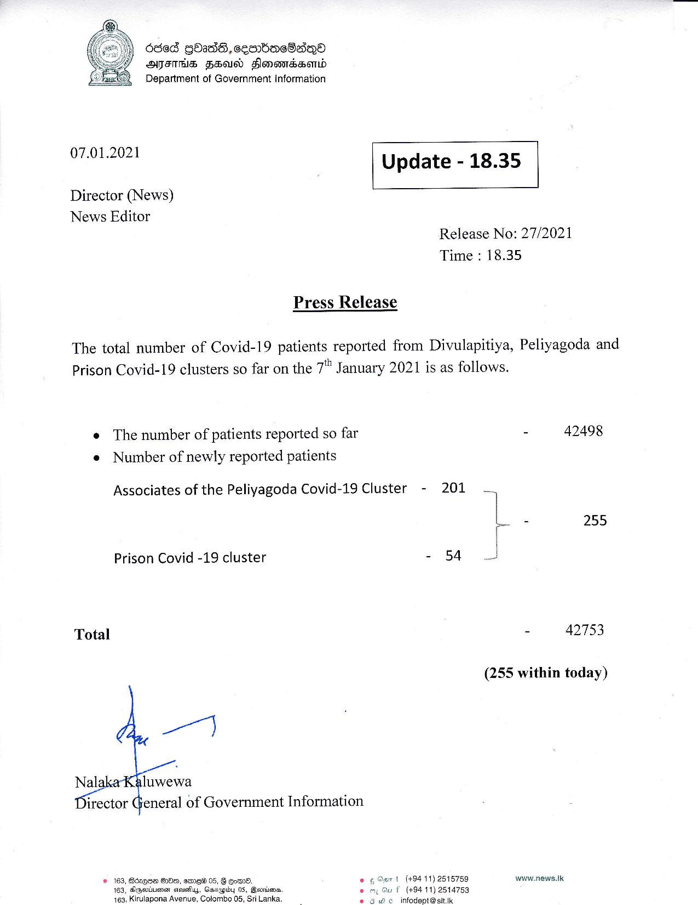

# Press Release - 2021.01.07 
Key: 2ae7fbf81be4ed2e2140ff7e78fad3a2 

---
```
Oded GOadS, cenbacSaqQo
AIHS FSO) Flomandssomd
Department of Government Information

 

 

07.01.2021 Update - 18.35

 

 

 

Director (News)

News Editor
Release No: 27/2021
Time : 18.35

Press Release

The total number of Covid-19 patients reported from Divulapitiya, Peliyagoda and
Prison Covid-19 clusters so far on the 7” January 2021 is as follows.

e The number of patients reported so far - 42498
e Number of newly reported patients

Associates of the Peliyagoda Covid-19 Cluster - 201

 

aa 255
Prison Covid -19 cluster - 54 5)
Total - 42753
(255 within today)
© 163, Aoz@ee GAen, emew 05,  eommd. e wt (+94 11) 2515759 www.news.Ik

   
 

 

Baie seus, Gasiagiby 05, Boorse. em Gu f (+9411) 2514753
ulapona Avenue, Colombo 05, Sri Lanka. e 3 infodept@sit.ik

 

```
