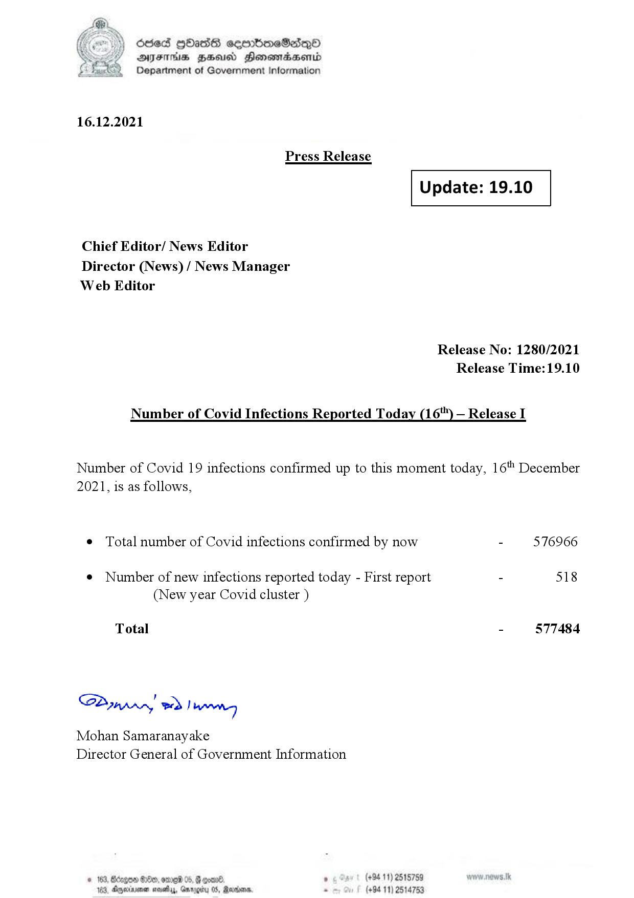

# Press Release - 2021.12.16 
Key: 2b16845874894f0678caf633408a0321 

---
```
)) SOsed Hbads sermbomeSadenoO
AIFS HSA Honomasentd
Department of Government Information

 

16.12.2021

Press Release

 

Update: 19.10

 

 

 

Chief Editor/ News Editor
Director (News) / News Manager
Web Editor

Release No: 1280/2021
Release Time:19.10

Number of Covid Infections Reported Today (16'") — Release I

Number of Covid 19 infections confirmed up to this moment today, 16" December
2021, is as follows,

¢ Total number of Covid infections confirmed by now - 576966

¢ Number of new infections reported today - First report - 518
(New year Covid cluster )

Total - 577484

Sa mprn! wd! wong

Mohan Samaranayake
Director General of Government Information

© 163, Bdrgon Ge, ome 05, F
163, Aparna sosehyy, Gnr

oom08) , (+9411) 2515759
05, Rerins. - (+84 11) 25

  

 
 

```
